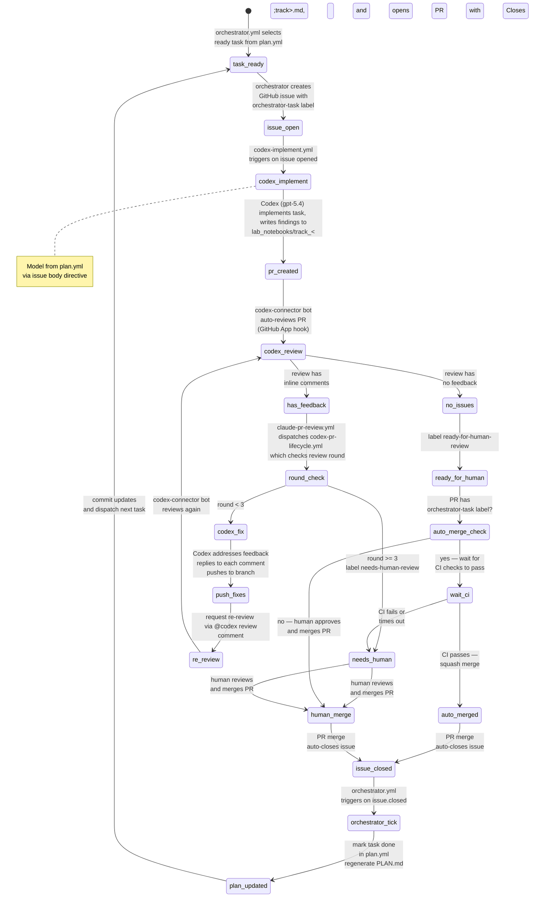

# PLAN Orchestrator

This directory contains an event-driven orchestrator that executes tasks from `plan.yml` using GitHub Issues for
sequencing and agent dispatch.

## Automation Lifecycle

The full issue-to-merge lifecycle is automated across three GitHub Actions workflows and one GitHub App:



### Actors

| Actor | Type | Role |
|---|---|---|
| `orchestrator.yml` | GitHub Actions workflow | Selects ready tasks, creates issues, marks tasks done, commits plan updates |
| `codex-implement.yml` | GitHub Actions workflow | Reacts to new `orchestrator-task` issues; runs Codex to implement and open a PR |
| `chatgpt-codex-connector[bot]` | GitHub App (external) | Automatically reviews every PR (installed on repo owner's account). Always posts `COMMENTED` reviews, never `APPROVED`. |
| `claude-pr-review.yml` | GitHub Actions workflow | Auto-reviews every PR on open/push via `claude-code-action`. Claude (Opus 4.6) submits formal `APPROVE`/`COMMENT` reviews and manages thread resolution. Posts as `claude[bot]`. |
| `codex-pr-lifecycle.yml` | GitHub Actions workflow | Dispatched by `claude-pr-review.yml` after a COMMENTED review; orchestrates Codex fix rounds and labels PRs. Uses concurrency groups to prevent parallel runs per PR. |
| Human reviewer | Person | Final approval and merge for non-Codex PRs or when auto-merge fails |

## Architecture

- **Source of truth:** `lyzortx/orchestration/plan.yml` — all tracks, tasks, dependencies, status, and acceptance
  criteria.
- **Rendered view:** `lyzortx/research_notes/PLAN.md` — auto-generated from `plan.yml` by `render_plan.py`. CI verifies
  it stays in sync.
- **Issue state:** GitHub issues labeled `orchestrator-task` are the authoritative progression signal. When an issue
  closes, the orchestrator marks the task `done` in `plan.yml` and regenerates `PLAN.md`.
- **Runtime state:** `lyzortx/generated_outputs/orchestration/runtime_state.json` — ephemeral per CI run, uploaded as
  artifact.

## Components

- `plan.yml` — task definitions (source of truth).
- `plan_parser.py` — pure functions: `load_plan`, `is_task_ready`, `select_ready_tasks`, `mark_task_done`. Parses
  `model` field from task entries.
- `parse_model_directive.py` — extracts model ID from `<!-- model: ... -->` HTML comments in issue bodies. Used by CI
  workflows and available as a CLI: `echo "$BODY" | python -m lyzortx.orchestration.parse_model_directive`.
- `render_plan.py` — generates `PLAN.md` from `plan.yml` with Mermaid DAG and track checklists.
- `orchestrator.py` — CLI runner that dispatches tasks as GitHub issues.
- `review_threads.py` — fetches unresolved PR review threads via GraphQL and formats them into a Codex feedback prompt.
  Includes a signing instruction so Codex identifies itself in every reply ("Posted by Codex \<model\>").
- `verify_review_replies.py` — checks that PR review comments have been addressed with replies.
- `ci_token_usage.py` — CLI for token/cost analysis across all LLM-invoking workflows (Codex + Claude).
- `.github/workflows/orchestrator.yml` — CI trigger: task dispatch and plan updates.
- `.github/workflows/codex-implement.yml` — CI trigger: Codex implements new `orchestrator-task` issues.
- `.github/workflows/codex-pr-lifecycle.yml` — CI trigger: Codex addresses review feedback on PRs.
- `.github/workflows/ci-duplicate-check.yml` — informational CI check: runs pylint `symilar` to detect duplicate code
  in `lyzortx/`. Does not block PRs (`continue-on-error: true`).

## Task Readiness

A task is ready when:

1. All prior tasks in the same track are `done` (sequential within track).
2. All tasks in all prerequisite tracks (from `depends_on`) are `done`.

Task IDs are derived from track letter + ordinal (e.g., `TB03`, `TF01`). Gates use `GNG` prefix.

## Task Authoring Guidance

Plan authors should size tasks by boundary risk, not just by how small the diff sounds.

- Use `gpt-5.4-mini` for bounded mechanical edits where the main risk is local code change.
- Use `gpt-5.4` for artifact-boundary tasks: downstream reruns after upstream schema/provenance changes, lock-rule
  changes, stale generated-output handling, or any task that adds a permissive fallback such as zero-fill.
- For fragile tasks, write low-freedom acceptance criteria. State the exact contract that changed and the exact failure
  modes to avoid.
- When a task introduces a fallback, acceptance criteria should require both:
  - a positive test for the intended narrow use
  - a negative test proving strict failure still happens outside that use
- When a task consumes generated artifacts, acceptance criteria should say whether stale default artifacts must be
  regenerated or rejected.

## CLI Usage

```bash
# Show status with ready tasks
python -m lyzortx.orchestration.orchestrator --command status --plan-path lyzortx/orchestration/plan.yml

# Dispatch one ready task (creates GitHub issue when GITHUB_TOKEN is set)
python -m lyzortx.orchestration.orchestrator --command run_once --plan-path lyzortx/orchestration/plan.yml

# Pause/resume
python -m lyzortx.orchestration.orchestrator --command pause --note "maintenance"
python -m lyzortx.orchestration.orchestrator --command resume

# Regenerate PLAN.md from plan.yml
python -m lyzortx.orchestration.render_plan
```

## GitHub Actions Trigger Model

### orchestrator.yml

- `workflow_dispatch`: manual commands (`run_once`, `status`, `pause`, `resume`).
- `repository_dispatch`: API/CLI command trigger.
- `issues.closed`: when an `orchestrator-task` issue closes, marks the task done and dispatches the next ready task.

A concurrency group (`orchestrator`) queues runs instead of running in parallel, preventing duplicate issue creation
when multiple trigger events fire simultaneously.

On each tick the workflow commits `plan.yml` and `PLAN.md` changes back to the repo.

Default `max_active_tasks` is `1` (CLI) or `50` (CI workflow). The `orchestrator-task` label is created automatically on
first dispatch. Dispatched issues also receive a `model-{id}` label (e.g., `model-gpt-5.4-mini`) for at-a-glance model
visibility.

### codex-implement.yml

- `issues.opened` / `issues.reopened`: triggers when an issue with the `orchestrator-task` label is created.
- `workflow_dispatch`: manual trigger with an issue number.

Builds a prompt from the issue body and acceptance criteria, extracts the model directive (`<!-- model: ... -->`) from
the issue body, then runs Codex with the specified model to implement the task and create a PR. The model directive is
required — the workflow fails if it is missing.

### claude-pr-review.yml

- `pull_request: [opened, synchronize]`: auto-reviews every PR on open or push.
- `issue_comment: [created]` / `pull_request_review_comment: [created]`: interactive `@claude` mentions.

Claude reads `AGENTS.md` review guidelines, submits formal `APPROVE` or `COMMENT` reviews via MCP GitHub tools, and is
the sole judge of thread resolution (can resolve/unresolve threads via GraphQL mutations). Requires the
`ANTHROPIC_API_KEY` repository secret. The workflow explicitly allows the repo's `czarphage` GitHub App bot to trigger
re-reviews after Codex pushes, which would otherwise be blocked by `claude-code-action`'s default "no bots" policy.
After reviewing, it auto-merges only when Claude's latest review is `APPROVED` and the PR has zero unresolved review
threads. If Claude leaves a `COMMENTED` review or any unresolved review threads remain, it dispatches
`codex-pr-lifecycle.yml`.

### codex-pr-lifecycle.yml

- `workflow_dispatch`: triggered by `claude-pr-review.yml` when review feedback remains unresolved, or manually with a
  PR number.

The `workflow_dispatch`-only trigger prevents a self-cancellation loop: when Codex replies to review threads, GitHub
emits `pull_request_review` events. Previously these events re-triggered the lifecycle workflow and cancelled the
in-progress Codex run via the concurrency group.

The `address-feedback` job runs the Codex fix loop. A concurrency group ensures only one lifecycle run per PR at a time,
preventing race conditions on the review round cap.
If the review has unresolved threads, Codex addresses them (up to 3 rounds). If no unresolved threads, the PR is
labeled `ready-for-human-review`. After 3 feedback rounds the PR is labeled `needs-human-review`. The fix loop extracts
the model from the linked issue (via the PR body's `Closes #N` reference) to use the same model as the original
implementation.

## Agent Instructions in Dispatched Issues

Each dispatched issue includes:

- Task description and acceptance criteria (from `plan.yml`).
- Model directive as an HTML comment: `<!-- model: gpt-5.4-mini -->`. The model is set per-task in `plan.yml` and
  emitted by `orchestrator.py` when creating the issue. Both `codex-implement.yml` and `codex-pr-lifecycle.yml` extract
  this directive and pass it to the Codex action. Both `model` and `acceptance_criteria` are required for all pending
  tasks — the orchestrator raises `ValueError` if either is missing.
- Instruction to write findings to `lyzortx/research_notes/lab_notebooks/track_<track>.md`.
- PR creation instructions using `gh pr create` with `Closes #<issue>`.
