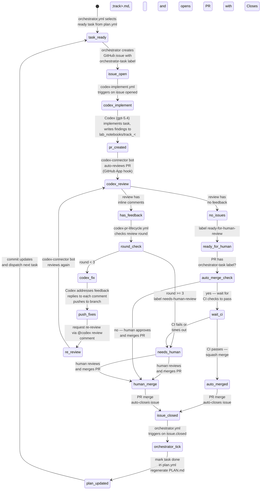

# PLAN Orchestrator

This directory contains an event-driven orchestrator that executes tasks from `plan.yml` using GitHub Issues for
sequencing and agent dispatch.

## Automation Lifecycle

The full issue-to-merge lifecycle is automated across three GitHub Actions workflows and one GitHub App:



### Actors

| Actor | Type | Role |
|---|---|---|
| `orchestrator.yml` | GitHub Actions workflow | Selects ready tasks, creates issues, marks tasks done, commits plan updates |
| `codex-implement.yml` | GitHub Actions workflow | Reacts to new `orchestrator-task` issues; runs Codex to implement and open a PR |
| `chatgpt-codex-connector[bot]` | GitHub App (external) | Automatically reviews every PR (installed on repo owner's account). Always posts `COMMENTED` reviews, never `APPROVED`. |
| `codex-pr-lifecycle.yml` | GitHub Actions workflow | Reacts to Codex reviews; orchestrates fix rounds, labels PR, or auto-merges Codex-created PRs |
| Human reviewer | Person | Final approval and merge for non-Codex PRs or when auto-merge fails |

## Architecture

- **Source of truth:** `lyzortx/orchestration/plan.yml` — all tracks, tasks, dependencies, status, and acceptance
  criteria.
- **Rendered view:** `lyzortx/research_notes/PLAN.md` — auto-generated from `plan.yml` by `render_plan.py`. CI verifies
  it stays in sync.
- **Issue state:** GitHub issues labeled `orchestrator-task` are the authoritative progression signal. When an issue
  closes, the orchestrator marks the task `done` in `plan.yml` and regenerates `PLAN.md`.
- **Runtime state:** `lyzortx/generated_outputs/orchestration/runtime_state.json` — ephemeral per CI run, uploaded as
  artifact.

## Components

- `plan.yml` — task definitions (source of truth).
- `plan_parser.py` — pure functions: `load_plan`, `is_task_ready`, `select_ready_tasks`, `mark_task_done`.
- `render_plan.py` — generates `PLAN.md` from `plan.yml` with Mermaid DAG and track checklists.
- `orchestrator.py` — CLI runner that dispatches tasks as GitHub issues.
- `verify_review_replies.py` — checks that PR review comments have been addressed with replies.
- `.github/workflows/orchestrator.yml` — CI trigger: task dispatch and plan updates.
- `.github/workflows/codex-implement.yml` — CI trigger: Codex implements new `orchestrator-task` issues.
- `.github/workflows/codex-pr-lifecycle.yml` — CI trigger: Codex addresses review feedback on PRs.

## Task Readiness

A task is ready when:

1. All prior tasks in the same track are `done` (sequential within track).
2. All tasks in all prerequisite tracks (from `depends_on`) are `done`.

Task IDs are derived from track letter + ordinal (e.g., `TB03`, `TF01`). Gates use `GNG` prefix.

## CLI Usage

```bash
# Show status with ready tasks
python -m lyzortx.orchestration.orchestrator --command status --plan-path lyzortx/orchestration/plan.yml

# Dispatch one ready task (creates GitHub issue when GITHUB_TOKEN is set)
python -m lyzortx.orchestration.orchestrator --command run_once --plan-path lyzortx/orchestration/plan.yml

# Pause/resume
python -m lyzortx.orchestration.orchestrator --command pause --note "maintenance"
python -m lyzortx.orchestration.orchestrator --command resume

# Regenerate PLAN.md from plan.yml
python -m lyzortx.orchestration.render_plan
```

## GitHub Actions Trigger Model

### orchestrator.yml

- `workflow_dispatch`: manual commands (`run_once`, `status`, `pause`, `resume`).
- `repository_dispatch`: API/CLI command trigger.
- `issues.closed`: when an `orchestrator-task` issue closes, marks the task done and dispatches the next ready task.

On each tick the workflow commits `plan.yml` and `PLAN.md` changes back to the repo.

Default `max_active_tasks` is `1` (CLI) or `50` (CI workflow). The `orchestrator-task` label is created automatically on
first dispatch.

### codex-implement.yml

- `issues.opened` / `issues.reopened`: triggers when an issue with the `orchestrator-task` label is created.
- `workflow_dispatch`: manual trigger with an issue number.

Builds a prompt from the issue body and acceptance criteria, then runs Codex (gpt-5.4) to implement the task and create
a PR.

### codex-pr-lifecycle.yml

- `pull_request_review.submitted`: triggers when `chatgpt-codex-connector[bot]` submits a review. Note: the connector
  always posts `COMMENTED` reviews (never `APPROVED`), so the workflow detects "clean" vs "has issues" by checking for
  inline comments and substantive body text rather than review state.
- `workflow_dispatch`: manual trigger with a PR number. Auto-merge is gated to `pull_request_review` events only to
  prevent manual dispatches from bypassing Codex review.

If the review has feedback, Codex addresses it (up to 3 rounds). If no feedback, the PR is labeled
`ready-for-human-review`. For Codex-created PRs (those with the `orchestrator-task` label), the workflow then waits for
CI checks to pass and auto-merges via squash merge. If CI fails or times out, the PR is labeled `needs-human-review`.
Non-Codex PRs with no feedback are left for human review. After 3 feedback rounds the PR is labeled
`needs-human-review`.

## Agent Instructions in Dispatched Issues

Each dispatched issue includes:

- Task description and acceptance criteria (from `plan.yml`).
- Instruction to write findings to `lyzortx/research_notes/lab_notebooks/track_<track>.md`.
- PR creation instructions using `gh pr create` with `Closes #<issue>`.
