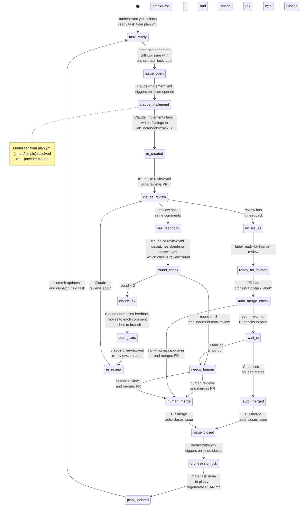

# PLAN Orchestrator

This directory contains an event-driven orchestrator that executes tasks from `plan.yml` using GitHub Issues for
sequencing and agent dispatch.

## Automation Lifecycle

The full issue-to-merge lifecycle is automated across three GitHub Actions workflows and one GitHub App:



### Actors

| Actor | Type | Role |
|---|---|---|
| `orchestrator.yml` | GitHub Actions workflow | Selects ready tasks, creates issues, marks tasks done, commits plan updates |
| `claude-implement.yml` | GitHub Actions workflow | Reacts to new `orchestrator-task` issues; runs Claude to implement and open a PR |
| `claude-pr-review.yml` | GitHub Actions workflow | Auto-reviews every PR on open/push via `claude-code-action`. Uses Opus on the opening review and Sonnet on re-reviews, submits formal `APPROVE`/`COMMENT` reviews, and manages thread resolution. Posts as `claude[bot]`. |
| `claude-pr-lifecycle.yml` | GitHub Actions workflow | Dispatched by `claude-pr-review.yml` after a COMMENTED review; orchestrates Claude fix rounds and labels PRs. Uses concurrency groups to prevent parallel runs per PR. |
| `chatgpt-codex-connector[bot]` | GitHub App (external) | Automatically reviews every PR (installed on repo owner's account). Always posts `COMMENTED` reviews, never `APPROVED`. |
| Human reviewer | Person | Final approval and merge when auto-merge fails |

## Architecture

- **Source of truth:** `lyzortx/orchestration/plan.yml` — all tracks, tasks, dependencies, status, and acceptance
  criteria.
- **Rendered view:** `lyzortx/research_notes/PLAN.md` — auto-generated from `plan.yml` by `render_plan.py`. CI verifies
  it stays in sync.
- **Issue state:** GitHub issues labeled `orchestrator-task` are the authoritative progression signal. When an issue
  closes, the orchestrator marks the task `done` in `plan.yml` and regenerates `PLAN.md`.
- **Runtime state:** `lyzortx/generated_outputs/orchestration/runtime_state.json` — ephemeral per CI run, uploaded as
  artifact.

## Components

- `plan.yml` — task definitions (source of truth).
- `plan_parser.py` — pure functions: `load_plan`, `is_task_ready`, `resolve_task_dependencies`,
  `select_ready_tasks`, `mark_task_done`. Parses `model`, optional `depends_on_tasks`, and optional
  `ci_image_profile` fields from task entries.
- `ci_image_profiles.py` — shared enum/mapping helpers for `ci_image_profile`, `ci-image:*` labels, and GHCR image
  refs used by the orchestrator and workflows.
- `parse_model_directive.py` — extracts semantic model tiers (`smart`/`simple`) from `<!-- model: ... -->` HTML comments
  in issue bodies and resolves them to concrete model IDs per provider. CLI usage:
  `echo "$BODY" | python -m lyzortx.orchestration.parse_model_directive --provider claude`.
- `render_plan.py` — generates `PLAN.md` from `plan.yml` with Mermaid DAG and track checklists.
- `orchestrator.py` — CLI runner that dispatches tasks as GitHub issues.
- `review_threads.py` — fetches unresolved PR review threads via GitHub GraphQL, paginates across thread pages, filters
  to unresolved non-outdated threads, and formats them into a feedback prompt for the implementing agent.
- `verify_review_replies.py` — checks that PR review comments have been addressed with replies.
- `ci_token_usage.py` — CLI for token/cost analysis across all LLM-invoking workflows (Claude).
- `.github/workflows/orchestrator.yml` — CI trigger: task dispatch and plan updates.
- `.github/workflows/claude-implement.yml` — CI trigger: Claude implements new `orchestrator-task` issues.
- `.github/workflows/claude-pr-lifecycle.yml` — CI trigger: Claude addresses review feedback on PRs.
- `.github/workflows/ci-duplicate-check.yml` — informational CI check: runs pylint `symilar` to detect duplicate code
  in `lyzortx/`. Does not block PRs (`continue-on-error: true`).

## Task Readiness

A task is ready when:

1. If the task does not declare `depends_on_tasks`, all prior tasks in the same track are `done` (sequential by
   default within track).
2. If the task does declare `depends_on_tasks`, only those explicit task IDs block it within the track. This is how
   the plan expresses intra-track parallelism such as "TL15/TL16/TL17 can start together, TL18 waits on all three."
3. All tasks in all prerequisite tracks (from `depends_on`) are `done`.

Task IDs are derived from track letter + ordinal (e.g., `TB03`, `TF01`). Gates use `GNG` prefix.

## Task Authoring Guidance

Plan authors should size tasks by boundary risk, not just by how small the diff sounds.

- Use `simple` for bounded mechanical edits where the main risk is local code change.
- Use `smart` for artifact-boundary tasks: downstream reruns after upstream schema/provenance changes, lock-rule
  changes, stale generated-output handling, or any task that adds a permissive fallback such as zero-fill.
- For fragile tasks, write low-freedom acceptance criteria. State the exact contract that changed and the exact failure
  modes to avoid.
- When a task introduces a fallback, acceptance criteria should require both:
  - a positive test for the intended narrow use
  - a negative test proving strict failure still happens outside that use
- When a task consumes generated artifacts, acceptance criteria should say whether stale default artifacts must be
  regenerated or rejected.

## CLI Usage

```bash
# Show status with ready tasks
python -m lyzortx.orchestration.orchestrator --command status --plan-path lyzortx/orchestration/plan.yml

# Dispatch one ready task (creates GitHub issue when GITHUB_TOKEN is set)
python -m lyzortx.orchestration.orchestrator --command run_once --plan-path lyzortx/orchestration/plan.yml

# Pause/resume
python -m lyzortx.orchestration.orchestrator --command pause --note "maintenance"
python -m lyzortx.orchestration.orchestrator --command resume

# Regenerate PLAN.md from plan.yml
python -m lyzortx.orchestration.render_plan
```

## GitHub Actions Trigger Model

### orchestrator.yml

- `workflow_dispatch`: manual commands (`run_once`, `status`, `pause`, `resume`).
- `repository_dispatch`: API/CLI command trigger.
- `issues.closed`: when an `orchestrator-task` issue closes, marks the task done and dispatches the next ready task.

A concurrency group (`orchestrator`) queues runs instead of running in parallel, preventing duplicate issue creation
when multiple trigger events fire simultaneously.

On each tick the workflow commits `plan.yml` and `PLAN.md` changes back to the repo.

Default `max_active_tasks` is `1` (CLI) or `50` (CI workflow). The `orchestrator-task` label is created automatically on
first dispatch. Dispatched issues also receive a `model-{tier}` label (e.g., `model-simple`) for at-a-glance tier
visibility plus a mirrored `ci-image:{profile}` label so workflows can route the task to the matching prebaked
container image. Missing profile labels are treated as configuration errors, not as permission to fall back.

### claude-implement.yml

- `issues.opened` / `issues.reopened`: triggers when an issue with the `orchestrator-task` label is created.
- `workflow_dispatch`: manual trigger with an issue number.

Resolves the CI image profile from the issue's `ci-image:*` label, then runs Claude inside the matching prebaked GHCR
image. Extracts the semantic model tier (`<!-- model: smart -->` or `<!-- model: simple -->`) from the issue body and
resolves it to a concrete Claude model ID via `parse_model_directive.py --provider claude`. Refreshes only the envs that
belong to that image profile, then runs Claude Code to implement the task and create a PR, passing the Czarphage GitHub
App token into the action so branch pushes and PR creation stay under `czarphage[bot]`. The model directive is
required — the workflow fails if it is missing.

### claude-pr-review.yml

- `pull_request: [opened, synchronize]`: auto-reviews every PR on open or push.
- `issue_comment: [created]` / `pull_request_review_comment: [created]`: interactive `@claude` mentions.

Claude reads `AGENTS.md` review guidelines, submits formal `APPROVE` or `COMMENT` reviews via MCP GitHub tools, and is
the sole judge of thread resolution (can resolve/unresolve threads via GraphQL mutations). The workflow uses Opus on the
opening review and Sonnet on `synchronize` re-reviews. It intentionally keeps the action's default GitHub identity so
formal reviews continue to come from `claude[bot]`, which downstream review-state checks depend on. Requires the
`ANTHROPIC_API_KEY` repository secret. The workflow explicitly allows the repo's `czarphage` GitHub App bot to trigger
re-reviews after Claude pushes, which would otherwise be blocked by `claude-code-action`'s default "no bots" policy.
After reviewing, it auto-merges only when Claude's latest review is `APPROVED` and the shared
`lyzortx.orchestration.review_threads` helper reports zero unresolved review threads. If Claude leaves a `COMMENTED`
review or any unresolved review threads remain, it dispatches `claude-pr-lifecycle.yml`.

### claude-pr-lifecycle.yml

- `workflow_dispatch`: triggered by `claude-pr-review.yml` when review feedback remains unresolved, or manually with a
  PR number.

The `workflow_dispatch`-only trigger prevents a self-cancellation loop: when Claude replies to review threads, GitHub
emits `pull_request_review` events. Previously these events re-triggered the lifecycle workflow and cancelled the
in-progress run via the concurrency group.

The `address-feedback` job runs the Claude fix loop. A concurrency group ensures only one lifecycle run per PR at a time,
preventing race conditions on the review round cap.
If the review has unresolved threads, Claude addresses them (up to 3 rounds). If no unresolved threads, the PR is
labeled `ready-for-human-review`. After 3 feedback rounds the PR is labeled `needs-human-review`. The fix loop extracts
the model tier from the linked issue (via the PR body's `Closes #N` reference) and resolves it via the same
`--provider claude` mechanism to use the same model as the original implementation. Like `claude-implement.yml`, it
passes the Czarphage GitHub App token into the Claude action so branch updates stay under `czarphage[bot]`.

Both Codex workflows now resolve their container image from `ci-image:*` labels mirrored from `plan.yml` into issues
and then onto PRs. The current image profiles are:

- `base` — `phage_env` only
- `host-typing` — `phage_env` plus `phylogroup_caller`, `serotype_caller`, and `sequence_type_caller`
- `full-bio` — `host-typing` plus `phage_annotation_tools`

Each job still executes env refreshes on startup, but only for the envs that belong to the selected profile, so repo
dependency changes can land without waiting for a new image publish.

## Cutover Policy

This CI-image routing is an intentional cutover, not a backward-compatible migration layer.

- Only post-cutover orchestrator issues and PRs are supported. They must carry exactly one `ci-image:*` label and the
  matching env manifests expected by the selected profile.
- Pre-cutover issues/PRs created before this contract existed are intentionally unsupported by the new Codex workflows.
  Re-dispatch or rebase them onto a branch that contains the CI-image manifests instead of expecting fallback behavior.
- Missing labels or missing env manifests are treated as hard configuration errors. The workflows do not silently fall
  back to older bootstrap paths or prebaked env contents.

## Agent Instructions in Dispatched Issues

Each dispatched issue includes:

- Task description and acceptance criteria (from `plan.yml`).
- Model tier as an HTML comment: `<!-- model: simple -->` or `<!-- model: smart -->`. The tier is set per-task in
  `plan.yml` and emitted by `orchestrator.py` when creating the issue. Both `claude-implement.yml` and
  `claude-pr-lifecycle.yml` extract this directive and resolve it to a concrete model ID via
  `parse_model_directive.py --provider claude`. Both `model` and `acceptance_criteria` are required for all pending
  tasks — the orchestrator raises `ValueError` if either is missing.
- CI image profile directive as an HTML comment and mirrored GitHub label. The profile is set per-task in `plan.yml`
  via `ci_image_profile` and mirrored into `ci-image:{profile}` labels for issue/PR routing. Pending tasks must declare
  this explicitly; missing labels fail the workflow rather than silently falling back.
- Instruction to write findings to `lyzortx/research_notes/lab_notebooks/track_<track>.md`.
- PR creation instructions using `gh pr create` with `Closes #<issue>`.
