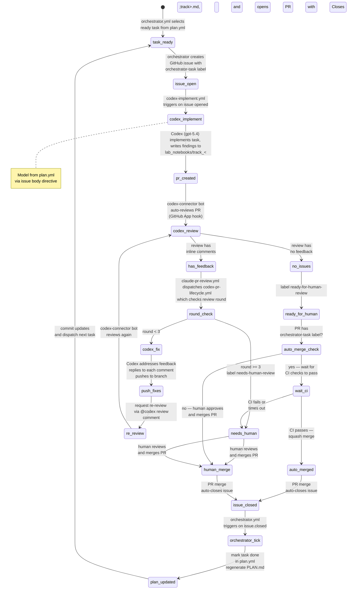

# PLAN Orchestrator

This directory contains an event-driven orchestrator that executes tasks from `plan.yml` using GitHub Issues for
sequencing and agent dispatch.

## Automation Lifecycle

The full issue-to-merge lifecycle is automated across three GitHub Actions workflows and one GitHub App:



### Actors

| Actor | Type | Role |
|---|---|---|
| `orchestrator.yml` | GitHub Actions workflow | Selects ready tasks, creates issues, marks tasks done, commits plan updates |
| `codex-implement.yml` | GitHub Actions workflow | Reacts to new `orchestrator-task` issues; runs Codex to implement and open a PR |
| `chatgpt-codex-connector[bot]` | GitHub App (external) | Automatically reviews every PR (installed on repo owner's account). Always posts `COMMENTED` reviews, never `APPROVED`. |
| `claude-pr-review.yml` | GitHub Actions workflow | Auto-reviews every PR on open/push via `claude-code-action`. Claude (Opus 4.6) submits formal `APPROVE`/`COMMENT` reviews and manages thread resolution. Posts as `claude[bot]`. |
| `codex-pr-lifecycle.yml` | GitHub Actions workflow | Dispatched by `claude-pr-review.yml` after a COMMENTED review; orchestrates Codex fix rounds and labels PRs. Uses concurrency groups to prevent parallel runs per PR. |
| `autoresearch-runpod.yml` | GitHub Actions workflow | Manual AUTORESEARCH search runner: stages a frozen cache bundle, provisions a locked RunPod pod behind an environment approval gate, executes one bounded `train.py` command, uploads candidate artifacts, and tears the pod down |
| Human reviewer | Person | Final approval and merge for non-Codex PRs or when auto-merge fails |

## Architecture

- **Source of truth:** `lyzortx/orchestration/plan.yml` — all tracks, tasks, dependencies, status, and acceptance
  criteria.
- **Rendered view:** `lyzortx/research_notes/PLAN.md` — auto-generated from `plan.yml` by `render_plan.py`. CI verifies
  it stays in sync.
- **Issue state:** GitHub issues labeled `orchestrator-task` are the authoritative progression signal. When an issue
  closes, the orchestrator marks the task `done` in `plan.yml` and regenerates `PLAN.md`.
- **Runtime state:** `lyzortx/generated_outputs/orchestration/runtime_state.json` — ephemeral per CI run, uploaded as
  artifact.

## Components

- `plan.yml` — task definitions (source of truth).
- `plan_parser.py` — pure functions: `load_plan`, `is_task_ready`, `resolve_task_dependencies`,
  `select_ready_tasks`, `mark_task_done`. Parses `model`, optional `depends_on_tasks`, and optional
  `ci_image_profile` fields from task entries.
- `ci_image_profiles.py` — shared enum/mapping helpers for `ci_image_profile`, `ci-image:*` labels, and GHCR image
  refs used by the orchestrator and workflows.
- `parse_model_directive.py` — extracts model ID from `<!-- model: ... -->` HTML comments in issue bodies. Used by CI
  workflows and available as a CLI: `echo "$BODY" | python -m lyzortx.orchestration.parse_model_directive`.
- `render_plan.py` — generates `PLAN.md` from `plan.yml` with Mermaid DAG and track checklists.
- `orchestrator.py` — CLI runner that dispatches tasks as GitHub issues.
- `review_threads.py` — fetches unresolved PR review threads via GitHub GraphQL, paginates across thread pages, filters
  to unresolved non-outdated threads, and formats them into a Codex feedback prompt. This remains the merge-gate helper
  used by `claude-pr-review.yml`.
- `pr_feedback.py` — fetches top-level PR conversation comments, inline review comments, and non-empty review bodies,
  then formats them into a Codex feedback prompt so lifecycle runs read every visible PR feedback surface.
- `verify_review_replies.py` — checks that PR review comments have been addressed with replies.
- `ci_token_usage.py` — CLI for token/cost analysis across all LLM-invoking workflows (Codex + Claude).
- `.github/workflows/orchestrator.yml` — CI trigger: task dispatch and plan updates.
- `.github/workflows/codex-implement.yml` — CI trigger: Codex implements new `orchestrator-task` issues.
- `.github/workflows/codex-pr-lifecycle.yml` — CI trigger: Codex addresses review feedback on PRs.
- `.github/workflows/autoresearch-runpod.yml` — manual GPU experiment runner for AUTORESEARCH. It either builds a
  fresh host-side cache bundle or reuses one from a prior workflow run, then provisions a fixed RunPod pod, copies only
  the AUTORESEARCH runtime bundle plus frozen cache artifacts, runs one bounded `train.py` command, uploads candidate
  outputs, and deletes the pod.
- `.github/workflows/ci-duplicate-check.yml` — informational CI check: runs pylint `symilar` to detect duplicate code
  in `lyzortx/`. Does not block PRs (`continue-on-error: true`).

## Task Readiness

A task is ready when:

1. If the task does not declare `depends_on_tasks`, all prior tasks in the same track are `done` (sequential by
   default within track).
2. If the task does declare `depends_on_tasks`, only those explicit task IDs block it within the track. This is how
   the plan expresses intra-track parallelism such as "TL15/TL16/TL17 can start together, TL18 waits on all three."
3. All tasks in all prerequisite tracks (from `depends_on`) are `done`.

Task IDs are derived from track letter + ordinal (e.g., `TB03`, `TF01`). Gates use `GNG` prefix.

## Task Authoring Guidance

Plan authors should size tasks by boundary risk, not just by how small the diff sounds.

- Use `gpt-5.4-mini` for bounded mechanical edits where the main risk is local code change.
- Use `gpt-5.4` for artifact-boundary tasks: downstream reruns after upstream schema/provenance changes, lock-rule
  changes, stale generated-output handling, or any task that adds a permissive fallback such as zero-fill.
- For fragile tasks, write low-freedom acceptance criteria. State the exact contract that changed and the exact failure
  modes to avoid.
- When a task introduces a fallback, acceptance criteria should require both:
  - a positive test for the intended narrow use
  - a negative test proving strict failure still happens outside that use
- When a task consumes generated artifacts, acceptance criteria should say whether stale default artifacts must be
  regenerated or rejected.
- Do not route paid cloud GPU experiments through `.github/workflows/codex-implement.yml`. If a track needs
  cloud-infrastructure provisioning or spend-bearing secrets (for example RunPod), add a separate manual workflow and a
  dedicated GitHub environment with environment-scoped secrets instead of broadening the default Codex workflow.
- For AUTORESEARCH-style tasks, treat raw inputs plus frozen featurizer code as the source of truth. Checked-in feature
  CSVs may be optional warm caches only; acceptance criteria should require rebuildability from raw data and should
  exclude panel-only metadata or proxies that cannot run on unseen FASTAs.
- For AUTORESEARCH plan design, split cache-building tasks by runtime-risk boundary when the stages use different
  toolchains or cost profiles. In this repo that means separate tickets for host defense, host surface, host typing,
  and phage projection instead of one broad "implement prepare.py" task.
- For AUTORESEARCH critical-path design, make the adsorption-first minimum cache sufficient for the first baseline when
  that is the most credible early substrate. Slower optional blocks such as host defense can join later as additive
  ablations instead of gating the first runnable search.
## CLI Usage

```bash
# Show status with ready tasks
python -m lyzortx.orchestration.orchestrator --command status --plan-path lyzortx/orchestration/plan.yml

# Dispatch one ready task (creates GitHub issue when GITHUB_TOKEN is set)
python -m lyzortx.orchestration.orchestrator --command run_once --plan-path lyzortx/orchestration/plan.yml

# Pause/resume
python -m lyzortx.orchestration.orchestrator --command pause --note "maintenance"
python -m lyzortx.orchestration.orchestrator --command resume

# Regenerate PLAN.md from plan.yml
python -m lyzortx.orchestration.render_plan
```

## GitHub Actions Trigger Model

### orchestrator.yml

- `workflow_dispatch`: manual commands (`run_once`, `status`, `pause`, `resume`).
- `repository_dispatch`: API/CLI command trigger.
- `issues.closed`: when an `orchestrator-task` issue closes, marks the task done and dispatches the next ready task.

A concurrency group (`orchestrator`) queues runs instead of running in parallel, preventing duplicate issue creation
when multiple trigger events fire simultaneously.

On each tick the workflow commits `plan.yml` and `PLAN.md` changes back to the repo.

Default `max_active_tasks` is `1` (CLI) or `50` (CI workflow). The `orchestrator-task` label is created automatically on
first dispatch. Dispatched issues also receive a `model-{id}` label (e.g., `model-gpt-5.4-mini`) for at-a-glance model
visibility plus a mirrored `ci-image:{profile}` label so workflows can route the task to the matching prebaked
container image. Missing profile labels are treated as configuration errors, not as permission to fall back.

### codex-implement.yml

- `issues.opened` / `issues.reopened`: triggers when an issue with the `orchestrator-task` label is created.
- `workflow_dispatch`: manual trigger with an issue number.

Resolves the CI image profile from the issue's `ci-image:*` label, then runs Codex inside the matching prebaked GHCR
image. Builds a prompt from the issue body and acceptance criteria, extracts the model directive (`<!-- model: ... -->`)
from the issue body, refreshes only the envs that belong to that image profile, then runs Codex with the specified
model to implement the task and create a PR. The model directive is required — the workflow fails if it is missing.

### claude-pr-review.yml

- `pull_request: [opened, synchronize]`: auto-reviews every PR on open or push.
- `issue_comment: [created]` / `pull_request_review_comment: [created]`: interactive `@claude` mentions.

Claude reads `AGENTS.md` review guidelines, submits formal `APPROVE` or `COMMENT` reviews via MCP GitHub tools, and is
the sole judge of thread resolution (can resolve/unresolve threads via GraphQL mutations). Requires the
`ANTHROPIC_API_KEY` repository secret. The workflow explicitly allows the repo's `czarphage` GitHub App bot to trigger
re-reviews after Codex pushes, which would otherwise be blocked by `claude-code-action`'s default "no bots" policy.
After reviewing, it auto-merges only when Claude's latest review is `APPROVED` and the shared
`lyzortx.orchestration.review_threads` helper reports zero unresolved review threads. If Claude leaves a `COMMENTED`
review or any unresolved review threads remain, it dispatches `codex-pr-lifecycle.yml`.

### codex-pr-lifecycle.yml

- `workflow_dispatch`: triggered by `claude-pr-review.yml` when review feedback remains unresolved, or manually with a
  PR number.

The `workflow_dispatch`-only trigger prevents a self-cancellation loop: when Codex replies to review threads, GitHub
emits `pull_request_review` events. Previously these events could re-trigger the lifecycle workflow while another
lifecycle run was already active for the same PR.

The `address-feedback` job runs the Codex fix loop. A concurrency group ensures only one lifecycle run per PR at a time,
queueing newer runs behind the active one to prevent race conditions on the review round cap without canceling
in-flight Codex work.
If the PR has any top-level PR comments, inline review comments, or non-empty review bodies from non-`czarphage`
authors, Codex reads them and addresses the feedback (up to 3 rounds). Only PRs with zero visible feedback artifacts
across those surfaces are labeled `ready-for-human-review`. After 3 feedback rounds the PR is labeled
`needs-human-review`. The fix loop extracts the model from the linked issue (via the PR body's `Closes #N` reference)
to use the same model as the original implementation.

Both Codex workflows now resolve their container image from `ci-image:*` labels mirrored from `plan.yml` into issues
and then onto PRs. The current image profiles are:

- `base` — `phage_env` only
- `host-typing` — `phage_env` plus `phylogroup_caller`, `serotype_caller`, and `sequence_type_caller`
- `full-bio` — `host-typing` plus `phage_annotation_tools`

Each job still executes env refreshes on startup, but only for the envs that belong to the selected profile, so repo
dependency changes can land without waiting for a new image publish.

### autoresearch-runpod.yml

- `workflow_dispatch`: manual AUTORESEARCH GPU search only.

This workflow is deliberately outside the generic Codex issue/PR loop. It has two phases:

1. **Stage the frozen host-side bundle.** Either:
   - build a fresh AUTORESEARCH cache on the GitHub-hosted side with `prepare.py`, then package the minimal runtime
     bundle; or
   - download a previously staged `autoresearch-runpod-bundle` artifact from an earlier workflow run.
2. **Run one bounded pod-side experiment.** After environment approval, provision one locked single-GPU RunPod pod,
   copy only the staged bundle, create `phage_env` inside the pod, run one bounded `train.py` command, pull candidate
   outputs back as a workflow artifact, and delete the pod.

The workflow exists to keep expensive, infrequent host-side cache building separate from many short `train.py` search
runs. Repeated experiments should normally point at an existing staged bundle instead of rebuilding AR03-AR06 outputs.

## AUTORESEARCH RunPod Contract

This is a human-approved lock, not an auto-selected cloud default.

- **Required GitHub environment:** `runpod-autoresearch`
- **Required environment secret:** `RUNPOD_API_KEY`
- **Approval gate:** configure required reviewers on the `runpod-autoresearch` GitHub environment. The workflow's
  RunPod job will not start until that environment is approved.
- **Locked pod spec:** community-cloud single-GPU `NVIDIA A40`, `48 GB` VRAM, `1` GPU, `50 GB` container disk,
  `20 GB` volume, public IP enabled, image `runpod/pytorch:2.1.0-py3.10-cuda11.8.0-devel-ubuntu22.04`.
- **Locked hourly price point:** `$0.35/hr` on RunPod's official GPU pricing page at the time AR08 was implemented.
- **Why this pod:** `train.py` is now a thin cache consumer, so it does not need the cheapest possible auto-selected
  GPU. The A40 lock buys more memory headroom than the nearby 24 GB options for essentially the same hourly cost, while
  staying within a single-GPU community-cloud budget.
- **Secret boundary:** `RUNPOD_API_KEY` is referenced only on the provisioning, status-polling, and teardown steps in
  `autoresearch-runpod.yml`. It is not injected into `codex-implement.yml`, `codex-pr-lifecycle.yml`, or the generic
  Codex action environment.
- **Host-to-RunPod handoff:** the host side packages exactly one bundle artifact containing:
  - `lyzortx/autoresearch/{prepare.py,train.py,README.md,program.md}`
  - minimal runtime support files (`environment.yml`, `requirements.txt`, `pyproject.toml`,
    `lyzortx/log_config.py`, `lyzortx/pipeline/autoresearch/runtime_contract.py`)
  - the frozen `lyzortx/generated_outputs/autoresearch/search_cache_v1/` tree
- **Pod-side responsibilities:** unpack the bundle, create `phage_env`, run the bounded `train.py` command, collect
  `ar07_baseline_summary.json`, `ar07_inner_val_predictions.csv`, the exact `train.py`, and RunPod metadata.
- **Out of bounds for the pod:** `prepare.py`, Picard assembly download, DefenseFinder execution, host typing calls,
  host-surface derivation, and phage projection rebuilding. Those stay on the host side or in prior staged bundles.

## Cutover Policy

This CI-image routing is an intentional cutover, not a backward-compatible migration layer.

- Only post-cutover orchestrator issues and PRs are supported. They must carry exactly one `ci-image:*` label and the
  matching env manifests expected by the selected profile.
- Pre-cutover issues/PRs created before this contract existed are intentionally unsupported by the new Codex workflows.
  Re-dispatch or rebase them onto a branch that contains the CI-image manifests instead of expecting fallback behavior.
- Missing labels or missing env manifests are treated as hard configuration errors. The workflows do not silently fall
  back to older bootstrap paths or prebaked env contents.

## Agent Instructions in Dispatched Issues

Each dispatched issue includes:

- Task description and acceptance criteria (from `plan.yml`).
- Model directive as an HTML comment: `<!-- model: gpt-5.4-mini -->`. The model is set per-task in `plan.yml` and
  emitted by `orchestrator.py` when creating the issue. Both `codex-implement.yml` and `codex-pr-lifecycle.yml` extract
  this directive and pass it to the Codex action. Both `model` and `acceptance_criteria` are required for all pending
  tasks — the orchestrator raises `ValueError` if either is missing.
- CI image profile directive as an HTML comment and mirrored GitHub label. The profile is set per-task in `plan.yml`
  via `ci_image_profile` and mirrored into `ci-image:{profile}` labels for issue/PR routing. Pending tasks must declare
  this explicitly; missing labels fail the workflow rather than silently falling back.
- Instruction to write findings to `lyzortx/research_notes/lab_notebooks/track_<track>.md`.
- PR creation instructions using `gh pr create` with `Closes #<issue>`.
