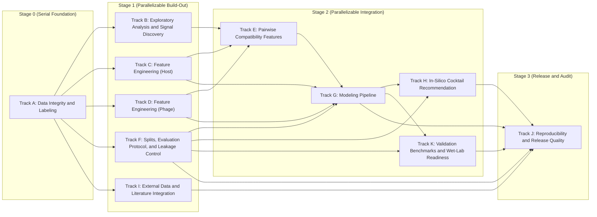

# Lyzor Tx In-Silico Pipeline Plan

## Parallel Execution View

- Tracks in the same stage box can run in parallel unless blocked by their own incoming dependencies.

## Steel Thread v0

### Execution Checklist

- [x] ST0.1 Define v0 label policy and uncertainty flags from raw interactions (`score='n'` included). Implemented in
      `lyzortx/pipeline/steel_thread_v0/steps/st01_label_policy.py`. Regression baseline:
      `lyzortx/pipeline/steel_thread_v0/baselines/st01_expected_metrics.json`.
- [x] ST0.1b Add strict confidence tiering (`high_conf_pos`, `high_conf_neg`, `ambiguous`) as a parallel output from
      ST0.1 to support dual-slice evaluation. Implemented in
      `lyzortx/pipeline/steel_thread_v0/steps/st01b_confidence_tiers.py`. Regression baseline:
      `lyzortx/pipeline/steel_thread_v0/baselines/st01b_expected_metrics.json`.
- [x] ST0.2 Build one canonical pair table with IDs, labels, uncertainty, and v0 feature blocks. Implemented in
      `lyzortx/pipeline/steel_thread_v0/steps/st02_build_pair_table.py`. Regression baseline:
      `lyzortx/pipeline/steel_thread_v0/baselines/st02_expected_metrics.json`.
- [x] ST0.3 Lock one leakage-safe split protocol and one fixed holdout benchmark for v0. Implemented in
      `lyzortx/pipeline/steel_thread_v0/steps/st03_build_splits.py`. Regression baseline:
      `lyzortx/pipeline/steel_thread_v0/baselines/st03_expected_metrics.json`.
- [x] ST0.4 Train one strong tabular baseline and one simple comparator baseline. Implemented in
      `lyzortx/pipeline/steel_thread_v0/steps/st04_train_baselines.py`. Regression baseline:
      `lyzortx/pipeline/steel_thread_v0/baselines/st04_expected_metrics.json`.
- [x] ST0.5 Calibrate probabilities and export ranked per-strain phage predictions. Implemented in
      `lyzortx/pipeline/steel_thread_v0/steps/st05_calibrate_rank.py`. Regression baseline:
      `lyzortx/pipeline/steel_thread_v0/baselines/st05_expected_metrics.json`.
- [x] ST0.6 Generate top-3 recommendations with policy-tuned defaults (`pred_logreg_platt`, no family cap). Implemented
      in `lyzortx/pipeline/steel_thread_v0/steps/st06_recommend_top3.py`. Regression baseline:
      `lyzortx/pipeline/steel_thread_v0/baselines/st06_expected_metrics.json`.
- [x] ST0.6b Compare ranking policy variants (`raw`, `platt`, `isotonic`; with/without family cap) to avoid
      recommendation-policy regressions. Implemented in
      `lyzortx/pipeline/steel_thread_v0/steps/st06b_compare_ranking_policies.py`.
- [x] ST0.7 Emit one reproducible report to `lyzortx/generated_outputs/steel_thread_v0/`. Implemented in
      `lyzortx/pipeline/steel_thread_v0/steps/st07_build_report.py`. Regression baseline:
      `lyzortx/pipeline/steel_thread_v0/baselines/st07_expected_metrics.json`.

### Go / No-Go Gates

- [ ] End-to-end command completes on a clean environment without manual patching.
- [x] No leakage violations detected by the v0 checks.
- [x] Top-3 hit-rate and calibration metrics are reported for the locked protocol.
- [ ] Top-3 and calibration metrics are reported on both slices: full-label and high-confidence (ST0.1b).
- [x] v0 model materially outperforms a naive baseline on the same split.
- [ ] Failure cases are documented with at least one concrete hypothesis per major error bucket.

## Track A: Data Integrity and Labeling

- [x] Build a canonical ID map for bacteria and phages across all tables. Implemented in
      `lyzortx/generated_outputs/track_a/id_map/{bacteria_id_map.csv,phage_id_map.csv}`.
- [x] Resolve naming/alias mismatches (for example legacy phage names). Implemented in
      `lyzortx/generated_outputs/track_a/id_map/{bacteria_alias_resolution.csv,phage_alias_resolution.csv}` and
      candidate reports.
- [x] Add automated data integrity checks for row/column consistency. Implemented in
      `lyzortx/generated_outputs/track_a/integrity/{integrity_checks.csv,integrity_report.json}` and
      `lyzortx/pipeline/track_a/checks/check_track_a_integrity.py`.
- [x] Define and document handling policy for uninterpretable labels (`score='n'`). Implemented in
      `lyzortx/generated_outputs/track_a/labels/{label_set_v1_policy.json,label_set_v2_policy.json}`.
- [x] Add plaque-image-assisted QC pass for ambiguous/conflicting pairs using the core study raw image release.
      Implemented in `lyzortx/generated_outputs/track_a/qc/{plaque_image_qc_queue.csv,plaque_image_qc_summary.json}`.
- [x] Define cohort contracts and denominator rules (`raw369`, `matrix402`, `features404`) for all reports. Implemented
      in `lyzortx/generated_outputs/track_a/cohort/{cohort_contracts.csv,cohort_contracts.json}`.
- [x] Preserve replicate and dilution structure in intermediate tables. Implemented in
      `lyzortx/generated_outputs/track_a/labels/{track_a_observations_with_ids.csv,`
      `track_a_pair_dilution_summary.csv,track_a_pair_observation_grid.csv}`.
- [x] Create label set v1: `any_lysis`, `lysis_strength`, `dilution_potency`, `uncertainty_flags`. Implemented in
      `lyzortx/generated_outputs/track_a/labels/label_set_v1_pairs.csv`.
- [x] Create label set v2 with alternative aggregation assumptions and compare impact. Implemented in
      `lyzortx/generated_outputs/track_a/labels/{label_set_v2_pairs.csv,label_set_v1_v2_comparison.csv}`.
- [x] Add scripts that regenerate all derived labels from raw data in one command. Implemented in
      `lyzortx/pipeline/track_a/run_track_a.py` (plus docs in `lyzortx/pipeline/track_a/README.md`).

## Track B: Exploratory Analysis and Signal Discovery

- [x] Profile raw interaction matrix composition and replicate consistency.
- [x] Quantify morphotype breadth and narrow-susceptibility patterns.
- [ ] Characterize hard-to-lyse strains by known host traits.
- [ ] Characterize "rescuer phages" for narrow-susceptibility strains.
- [ ] Analyze dilution-response patterns per phage and per bacterial subgroup.
- [ ] Build uncertainty map: where annotation conflicts are concentrated.
- [ ] Prioritize candidate mechanistic feature hypotheses from EDA findings.

## Track C: Feature Engineering (Host)

- [ ] Build receptor/surface feature block: O/K/LPS-related loci and known receptor proxies.
- [ ] Add outer membrane receptor variant features.
- [ ] Encode phylogeny-aware host embeddings with leakage-safe generation.
- [ ] Build defense-system context block (presence, subtype, burden, co-occurrence).
- [ ] Add missingness indicators and confidence scores for host features.
- [ ] Version host feature matrix with schema and provenance manifest.

## Track D: Feature Engineering (Phage)

- [ ] Build phage sequence processing pipeline from genome/protein files.
- [ ] Extract RBP/depolymerase/domain features (HMM/domain and structure-aware proxies).
- [ ] Pilot structure-aware RBP embeddings (PHIStruct-style) for low-similarity generalization.
- [ ] Build phage protein family embeddings or pangenome cluster features.
- [ ] Add phage architecture/taxonomy/module features.
- [ ] Add isolation-host and lineage priors as weak features (not dominant).
- [ ] Version phage feature matrix with schema and provenance manifest.

## Track E: Pairwise Compatibility Features

- [ ] Design phage-host compatibility features (RBP family vs host receptor proxies).
- [ ] Add domain-level compatibility scores.
- [ ] Add feature interactions for adsorption-relevant host/phage pairs.
- [ ] Add uncertainty-aware pairwise features (confidence-weighted signals).

## Track F: Splits, Evaluation Protocol, and Leakage Control

- [ ] Define fixed split protocol before model iteration: leave-cluster-out host splits and phage-clade holdouts.
- [ ] Keep a strict untouched external test benchmark for final validation.
- [ ] Add leakage checks for all split strategies.
- [ ] Add LOGOCV-style grouped validation and mean-hit-ratio@k reporting for recommendation utility tracking.
- [ ] Add bootstrap confidence intervals for strain-level top-k metrics to quantify variance on small holdouts.
- [ ] Add dual-slice reporting for all benchmarks: full-label slice and strict-confidence slice.
- [ ] Add source-aware evaluation for external integration: leave-one-datasource-out and cross-source transfer
      benchmarks.
- [ ] Add source-aware leakage checks: ensure no duplicated isolates/genomes leak across datasource boundaries.
- [ ] Add pre-Tier-1 progress gates for internal-only iteration (delta vs locked ST0.6 baseline, not only absolute
      thresholds).
- [ ] Define Tier 1 (current-panel feasible) benchmark suite:
  - **Top-3 Lytic Hit Rate (all strains, fixed panel) >= 95%**; stretch target >= 96.5%.
  - **Top-3 Lytic Hit Rate (susceptible strains only) >= 98%**.
  - **Precision at high confidence >= 99%** with minimum support threshold (report both precision and support).
  - **Calibration quality gates:** Brier score and ECE tracked for each model version.
- [ ] Define Tier 2 (north-star) benchmark suite:
  - **Top-3 Lytic Hit Rate (all strains) > 98%** after justified panel expansion and external integration.
  - **Simulated 3-phage cocktail coverage > 98%** in expanded-panel evaluation.
- [ ] Add benchmark report template for fair model-to-model comparison.

## Track G: Modeling Pipeline

- **Guiding Principle:** A "meaningful model" for this project is one that produces a **calibrated probability of
  lysis** for any given phage-bacterium pair, enabling nuanced downstream cocktail recommendations.
- [ ] Baseline 1: strong tabular binary model on existing host-only features.
- [ ] Baseline 2: joint host+phage feature model without pairwise interactions.
- [ ] Milestone G0: ship a calibrated Baseline 2 with leakage-safe protocol before mechanistic branching.
- [ ] Milestone G0.1: ship receptor-first enriched baseline (host adsorption proxies + phage RBP/depolymerase features)
      before broad weak-label expansion.
- [ ] External-data training order: internal-only baseline -> +Tier A supervised sources -> +Tier B weak-label sources.
- [ ] Stretch branch: Stage A model `P(adsorption)` from host-surface + phage-RBP + compatibility features.
- [ ] Stretch branch: Stage B model `P(productive_lysis | adsorption)` from post-entry features.
- [ ] Stretch branch: compose final probability `P(lysis) = P(adsorption) * P(productive_lysis | adsorption)`.
- [ ] Add multi-task formulation for binary + strength + potency targets.
- [ ] Add calibrated outputs (isotonic/Platt) and uncertainty intervals.
- [ ] Add label-noise-aware training variants (confidence-weighted or probabilistic labels from replicate structure).
- [ ] Add ablation matrix to measure where signal comes from: host-only, phage-only, pairwise-only, and no-identity
      controls.
- [ ] Add robust handling of class imbalance and label uncertainty.
- [ ] Add model interpretation outputs (global and per-sample).

## Track H: In-Silico Cocktail Recommendation

- [x] Benchmark policy variants for top-k recommendation and lock a non-regressing default (`ST0.6b` diagnostics).
- [ ] Add policy guardrail: do not expect top-k gains from monotonic score recalibration alone; require demonstrable
      ranking change from non-monotonic transformation, new model signal, or new constraints/objectives.
- [ ] Replace heuristic-only recommender with optimization-based recommender.
- [ ] Define objective: maximize expected coverage and potency under uncertainty.
- [ ] Add constraints: diversity, redundancy penalties, and risk-aware terms.
- [ ] Compare against baseline and generic recipes on held-out evaluation sets.
- [ ] Evaluate robustness under perturbations of uncertain interactions.
- [ ] Add recommendation explanations at per-strain and per-cocktail levels.

## Track I: External Data and Literature Integration

- [x] Create a curated reading list of closely related phage-host prediction papers. Reference:
      `lyzortx/research_notes/LITERATURE.md`.
- [x] Build `source_registry.csv` for all external sources: source type, label kind, host resolution, assay type,
      license, access path, last checked. Implemented in `lyzortx/research_notes/external_data/source_registry.csv`.
- [ ] For VHRdb ingest, keep source-fidelity fields: global response, datasource response, disagreement flag, and
      source-native reference link.
- [ ] Tier A supervised ingestion priority:
  1. VHRdb, 2) BASEL, 3) KlebPhaCol, 4) GPB.
- [ ] Define harmonization protocol for Tier A datasets: taxonomy normalization, ID mapping, assay-scale mapping,
      uncertainty flags.
- [ ] Tier B weak-label ingestion: Virus-Host DB and NCBI Virus/BioSample metadata with confidence tiering.
- [ ] Define confidence tiers for external labels (for example assay-backed, metadata-only, inferred).
- [ ] Integrate external data as a non-blocking enhancer: internal-only baseline must remain runnable and reportable.
- [ ] Run strict ablations in sequence: internal-only -> +VHRdb -> +BASEL -> +KlebPhaCol -> +GPB -> +Tier B weak labels.
- [ ] Track incremental lift and failure modes by datasource and confidence tier.

## Track J: Reproducibility and Release Quality

- [ ] One command to regenerate core figures/tables from raw and versioned inputs.
- [ ] Freeze environment specs and seeds for each benchmark run.
- [ ] Publish data/feature/model manifests with checksums.
- [ ] Add CI checks for schema drift, reproducibility scripts, and key metrics.
- [ ] Track external data-use restrictions and license terms in manifests and release notes.
- [ ] Keep generated outputs under `lyzortx/generated_outputs/` only.
- [ ] Keep one-off scripts that feed notes under `lyzortx/research_notes/ad_hoc_analysis_code/`.

## Track K: Validation Benchmarks and Wet-Lab Readiness

- [ ] Define a set of held-out validation cases: known-answer pairs withheld from training that the model must recover
      convincingly before predictions are sent for external wet-lab testing.
- [ ] Report validation recovery rate and calibrated confidence for each model version — predictions below a confidence
      threshold are flagged as not ready for production/testing.
- [ ] Prepare a small batch of novel _E. coli_ strain predictions (strains unseen during training) formatted for
      external CDMO production and plaque-assay validation.
- [ ] Define a feedback protocol: wet-lab validation results feed back into the pipeline as ground-truth labels for the
      next training cycle.
- [ ] Track prediction-vs-reality concordance across validation batches to build empirical credibility.
