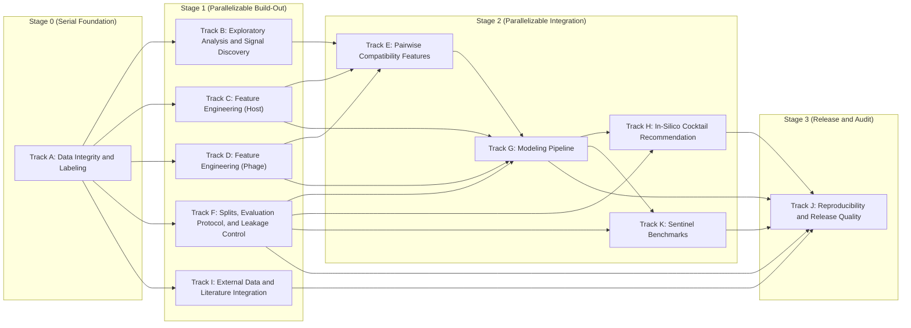

# Lyzor Tx In-Silico Pipeline Plan

Last updated: 2026-02-15

## Mission
- Build the best possible phage-lysis prediction pipeline for *E. coli* using only in-silico methods.
- Primary local data source:
  `data/interactions/raw/raw_interactions.csv` and related repo metadata/features.
- No wet-lab access is assumed for this project.
- External data and literature can be added when they improve model quality or rigor.

## Operating Rules
- Treat this file as the main execution driver for the repo.
- Update checklist status in this file as work progresses.
- Link every major code change or note update to one or more items here.
- Keep methods reproducible and auditable (deterministic where possible).
- Use two KPI tiers:
  - **Tier 1 (Current Panel, Feasible):** evaluation with current 96-phage panel and current interaction matrix.
  - **Tier 2 (North-Star):** aspirational targets that may require panel expansion and external data.

## Parallel Execution View
- Use this view for planning workstreams.
- Tracks in the same stage box can run in parallel unless blocked by their own incoming dependencies.
- Keep the dependency DAG above as the source of truth for strict ordering.

## Track A: Data Integrity and Labeling
- [ ] Build a canonical ID map for bacteria and phages across all tables.
- [ ] Resolve naming/alias mismatches (for example legacy phage names).
- [ ] Add automated data integrity checks for row/column consistency.
- [ ] Define and document handling policy for uninterpretable labels (`score='n'`).
- [ ] Define cohort contracts and denominator rules (`raw369`, `matrix402`, `features404`) for all reports.
- [ ] Preserve replicate and dilution structure in intermediate tables.
- [ ] Create label set v1:
  `any_lysis`, `lysis_strength`, `dilution_potency`, `uncertainty_flags`.
- [ ] Create label set v2 with alternative aggregation assumptions and compare impact.
- [ ] Add scripts that regenerate all derived labels from raw data in one command.

## Track B: Exploratory Analysis and Signal Discovery
- [x] Profile raw interaction matrix composition and replicate consistency.
- [x] Quantify morphotype breadth and narrow-susceptibility patterns.
- [ ] Characterize hard-to-lyse strains by known host traits.
- [ ] Characterize "rescuer phages" for narrow-susceptibility strains.
- [ ] Analyze dilution-response patterns per phage and per bacterial subgroup.
- [ ] Build uncertainty map: where annotation conflicts are concentrated.
- [ ] Prioritize candidate mechanistic feature hypotheses from EDA findings.

## Track C: Feature Engineering (Host)
- [ ] Build receptor/surface feature block:
  O/K/LPS-related loci and known receptor proxies.
- [ ] Add outer membrane receptor variant features.
- [ ] Encode phylogeny-aware host embeddings with leakage-safe generation.
- [ ] Build defense-system context block (presence, subtype, burden, co-occurrence).
- [ ] Add missingness indicators and confidence scores for host features.
- [ ] Version host feature matrix with schema and provenance manifest.

## Track D: Feature Engineering (Phage)
- [ ] Build phage sequence processing pipeline from genome/protein files.
- [ ] Extract RBP/depolymerase/domain features (HMM/domain and structure-aware proxies).
- [ ] Build phage protein family embeddings or pangenome cluster features.
- [ ] Add phage architecture/taxonomy/module features.
- [ ] Add isolation-host and lineage priors as weak features (not dominant).
- [ ] Version phage feature matrix with schema and provenance manifest.

## Track E: Pairwise Compatibility Features
- [ ] Design phage-host compatibility features (RBP family vs host receptor proxies).
- [ ] Add domain-level compatibility scores.
- [ ] Add feature interactions for adsorption-relevant host/phage pairs.
- [ ] Add uncertainty-aware pairwise features (confidence-weighted signals).

## Track F: Splits, Evaluation Protocol, and Leakage Control
- [ ] Define fixed split protocol before model iteration:
  leave-cluster-out host splits and phage-clade holdouts.
- [ ] Keep a strict untouched external test benchmark for final validation.
- [ ] Add leakage checks for all split strategies.
- [ ] Define Tier 1 (current-panel feasible) benchmark suite:
  - **Top-3 Lytic Hit Rate (all strains, fixed panel) >= 95%**; stretch target >= 96.5%.
  - **Top-3 Lytic Hit Rate (susceptible strains only) >= 98%**.
  - **Precision at high confidence >= 99%** with minimum support threshold (report both precision and support).
  - **Calibration quality gates:** Brier score and ECE tracked for each model version.
- [ ] Define Tier 2 (north-star) benchmark suite:
  - **Top-3 Lytic Hit Rate (all strains) > 98%** after justified panel expansion and external integration.
  - **Simulated 3-phage cocktail coverage > 98%** in expanded-panel evaluation.
- [ ] Add benchmark report template for fair model-to-model comparison.

## Track G: Modeling Pipeline
- **Guiding Principle:** A "meaningful model" for this project is one that produces a
  **calibrated probability of lysis** for any given phage-bacterium pair, enabling nuanced downstream
  cocktail recommendations.
- [ ] Baseline 1: strong tabular binary model on existing host-only features.
- [ ] Baseline 2: joint host+phage feature model without pairwise interactions.
- [ ] Milestone G0: ship a calibrated Baseline 2 with leakage-safe protocol before mechanistic branching.
- [ ] Stretch branch: Stage A model `P(adsorption)` from host-surface + phage-RBP + compatibility features.
- [ ] Stretch branch: Stage B model `P(productive_lysis | adsorption)` from post-entry features.
- [ ] Stretch branch: compose final probability
  `P(lysis) = P(adsorption) * P(productive_lysis | adsorption)`.
- [ ] Add multi-task formulation for binary + strength + potency targets.
- [ ] Add calibrated outputs (isotonic/Platt) and uncertainty intervals.
- [ ] Add robust handling of class imbalance and label uncertainty.
- [ ] Add model interpretation outputs (global and per-sample).

## Track H: In-Silico Cocktail Recommendation
- [ ] Replace heuristic-only recommender with optimization-based recommender.
- [ ] Define objective:
  maximize expected coverage and potency under uncertainty.
- [ ] Add constraints:
  diversity, redundancy penalties, and risk-aware terms.
- [ ] Compare against baseline and generic recipes on held-out evaluation sets.
- [ ] Evaluate robustness under perturbations of uncertain interactions.
- [ ] Add recommendation explanations at per-strain and per-cocktail levels.

## Track I: External Data and Literature Integration
- [ ] Systematically query public databases (Virus-Host DB, NCBI BioSample) to compile an
  expanded set of phage-host interaction pairs.
- [ ] Create a curated reading list of closely related phage-host prediction papers.
- [ ] Extract reusable methods and feature ideas into a structured note table.
- [ ] Search for compatible external interaction datasets and assess merge feasibility.
- [ ] Define data harmonization protocol for external dataset integration.
- [ ] Define confidence tiers for external labels (for example assay-backed, metadata-only, inferred).
- [ ] Integrate external data as a non-blocking enhancer: internal-only baseline must remain runnable and reportable.
- [ ] Run ablations to quantify value added from external data/features.

## Track J: Reproducibility and Release Quality
- [ ] One command to regenerate core figures/tables from raw and versioned inputs.
- [ ] Freeze environment specs and seeds for each benchmark run.
- [ ] Publish data/feature/model manifests with checksums.
- [ ] Add CI checks for schema drift, reproducibility scripts, and key metrics.
- [ ] Keep generated outputs under `lyzortx/generated_outputs/` only.
- [ ] Keep one-off scripts that feed notes under
  `lyzortx/research_notes/ad_hoc_analysis_code/`.

## Track K: Sentinel Benchmarks
- [ ] Define a set of sentinel tailored cases (hard but biologically plausible hits).
- [ ] **Sentinel Strain Recovery = 100%:** Model must correctly identify known solutions for all sentinel strains.
- [ ] Require each major model version to report sentinel recovery performance.
- [ ] Track regressions in sentinel behavior across pipeline updates.

## Immediate Next Tasks
- [ ] Finalize `score='n'` handling policy and document aggregation rules.
- [ ] Lock denominator/cohort policy and publish metric definitions for Tier 1 vs Tier 2 benchmarks.
- [ ] Build canonical ID normalization and mismatch report script.
- [ ] Implement label builder for binary/strength/potency targets from raw interactions.
- [ ] Implement first calibrated joint host+phage baseline with fixed leakage-safe splits.
