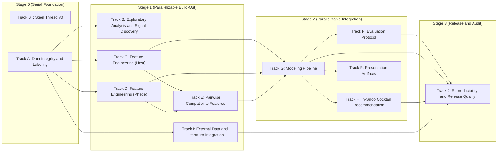

# Lyzor Tx In-Silico Pipeline Plan

## Parallel Execution View

- Tracks in the same stage box can run in parallel unless blocked by their own incoming dependencies.

## Track ST: Steel Thread v0

- **Guiding Principle:** Prove end-to-end viability with a minimal but honest pipeline using internal data only.
- [x] Define v0 label policy and uncertainty flags from raw interactions. Implemented in
      `lyzortx/pipeline/steel_thread_v0/steps/st01_label_policy.py`. Regression baseline:
      `lyzortx/pipeline/steel_thread_v0/baselines/st01_expected_metrics.json`.
- [x] Add strict confidence tiering as a parallel output from ST0.1 to support dual-slice evaluation. Implemented in
      `lyzortx/pipeline/steel_thread_v0/steps/st01b_confidence_tiers.py`. Regression baseline:
      `lyzortx/pipeline/steel_thread_v0/baselines/st01b_expected_metrics.json`.
- [x] Build one canonical pair table with IDs, labels, uncertainty, and v0 feature blocks. Implemented in
      `lyzortx/pipeline/steel_thread_v0/steps/st02_build_pair_table.py`. Regression baseline:
      `lyzortx/pipeline/steel_thread_v0/baselines/st02_expected_metrics.json`.
- [x] Lock one leakage-safe split protocol and one fixed holdout benchmark for v0. Implemented in
      `lyzortx/pipeline/steel_thread_v0/steps/st03_build_splits.py`. Regression baseline:
      `lyzortx/pipeline/steel_thread_v0/baselines/st03_expected_metrics.json`.
- [x] Train one strong tabular baseline and one simple comparator baseline. Implemented in
      `lyzortx/pipeline/steel_thread_v0/steps/st04_train_baselines.py`. Regression baseline:
      `lyzortx/pipeline/steel_thread_v0/baselines/st04_expected_metrics.json`.
- [x] Calibrate probabilities and export ranked per-strain phage predictions. Implemented in
      `lyzortx/pipeline/steel_thread_v0/steps/st05_calibrate_rank.py`. Regression baseline:
      `lyzortx/pipeline/steel_thread_v0/baselines/st05_expected_metrics.json`.
- [x] Generate top-3 recommendations with policy-tuned defaults. Implemented in
      `lyzortx/pipeline/steel_thread_v0/steps/st06_recommend_top3.py`. Regression baseline:
      `lyzortx/pipeline/steel_thread_v0/baselines/st06_expected_metrics.json`.
- [x] Compare ranking policy variants to avoid recommendation-policy regressions. Implemented in
      `lyzortx/pipeline/steel_thread_v0/steps/st06b_compare_ranking_policies.py`.
- [x] Emit one reproducible report to generated_outputs/steel_thread_v0/. Implemented in
      `lyzortx/pipeline/steel_thread_v0/steps/st07_build_report.py`. Regression baseline:
      `lyzortx/pipeline/steel_thread_v0/baselines/st07_expected_metrics.json`.
- [x] Add dual-slice reporting (full-label and strict-confidence) to ST0.7
- [x] Document failure case hypotheses for each major holdout miss error bucket

## Track A: Data Integrity and Labeling

- **Guiding Principle:** Canonical IDs, label policies, cohort contracts, and replicate-aware label sets from raw data.
- [x] Build a canonical ID map for bacteria and phages across all tables. Implemented in
      `lyzortx/generated_outputs/track_a/id_map/{bacteria_id_map.csv,phage_id_map.csv}`.
- [x] Resolve naming/alias mismatches (for example legacy phage names). Implemented in
      `lyzortx/generated_outputs/track_a/id_map/{bacteria_alias_resolution.csv,phage_alias_resolution.csv}`.
- [x] Add automated data integrity checks for row/column consistency. Implemented in
      `lyzortx/pipeline/track_a/checks/check_track_a_integrity.py`.
- [x] Define and document handling policy for uninterpretable labels (score='n'). Implemented in
      `lyzortx/generated_outputs/track_a/labels/{label_set_v1_policy.json,label_set_v2_policy.json}`.
- [x] Add plaque-image-assisted QC pass for ambiguous/conflicting pairs. Implemented in
      `lyzortx/generated_outputs/track_a/qc/{plaque_image_qc_queue.csv,plaque_image_qc_summary.json}`.
- [x] Define cohort contracts and denominator rules for all reports. Implemented in
      `lyzortx/generated_outputs/track_a/cohort/{cohort_contracts.csv,cohort_contracts.json}`.
- [x] Preserve replicate and dilution structure in intermediate tables. Implemented in
      `lyzortx/generated_outputs/track_a/labels/track_a_observations_with_ids.csv`.
- [x] Create label set v1: any_lysis, lysis_strength, dilution_potency, uncertainty_flags. Implemented in
      `lyzortx/generated_outputs/track_a/labels/label_set_v1_pairs.csv`.
- [x] Create label set v2 with alternative aggregation assumptions and compare impact. Implemented in
      `lyzortx/generated_outputs/track_a/labels/{label_set_v2_pairs.csv,label_set_v1_v2_comparison.csv}`.
- [x] Add scripts that regenerate all derived labels from raw data in one command. Implemented in
      `lyzortx/pipeline/track_a/run_track_a.py`.

## Track B: Exploratory Analysis and Signal Discovery

- **Guiding Principle:** Profile interactions, identify hard-to-lyse strains, rescuer phages, and dilution-response
  patterns.
- [x] Profile raw interaction matrix composition and replicate consistency
- [x] Quantify morphotype breadth and narrow-susceptibility patterns
- [x] Characterize hard-to-lyse strains by known host traits
- [x] Characterize rescuer phages for narrow-susceptibility strains
- [x] Analyze dilution-response patterns per phage and per bacterial subgroup

## Track C: Feature Engineering (Host)

- **Guiding Principle:** Defense-system subtypes, OMP receptor variants, capsule/LPS detail, and phylogenomic embeddings
  for host strains.
- [x] Build defense-system subtype feature block from defense_finder annotations
- [x] Build OMP receptor variant feature block from BLAST cluster assignments
- [x] Build extended host surface features (capsule detail, LPS core, UMAP embeddings)
- [x] Integrate host feature blocks into v1 pair table

## Track D: Feature Engineering (Phage)

- **Guiding Principle:** RBP features, genome k-mer embeddings, and phage distance embeddings from existing genomic
  data.
- [x] Build RBP feature block from RBP_list.csv annotations
- [x] Build genome k-mer embedding features from phage FNA files
- [x] Build phage distance embedding from VIRIDIC phylogenetic tree

## Track E: Pairwise Compatibility Features

- **Guiding Principle:** RBP-receptor compatibility, defense evasion proxy, and phylogenetic distance features that
  break the popular-phage bias.
- [x] Build RBP-receptor compatibility features from curated genus-receptor lookup
- [x] Build defense evasion proxy features from training-fold collaborative filtering
- [x] Build phylogenetic distance to isolation host features

## Track F: Evaluation Protocol

- **Guiding Principle:** Lock v1 benchmark split and add bootstrap confidence intervals. ST03 already provides
  leakage-safe host-group and phage-family holdouts.
- [ ] Lock ST03 split as v1 benchmark and add bootstrap CIs for all metrics Model: `gpt-5.4-mini`.
- [ ] Before/after comparison of v0 vs v1 with error bucket analysis Model: `gpt-5.4-mini`.

## Track G: Modeling Pipeline

- **Guiding Principle:** LightGBM model on expanded genomic features with calibration, ablation, and SHAP
  interpretation.
- [x] Train LightGBM binary classifier on v1 expanded feature set
- [x] Calibrate GBM outputs with isotonic and Platt scaling
- [x] Run feature-block ablation suite proving which features deliver lift
- [x] Compute SHAP explanations for per-pair and global feature importance
- [x] Run feature-subset sweep to find best block combination for top-3 ranking

## Track H: In-Silico Cocktail Recommendation

- **Guiding Principle:** Top-k recommendations with SHAP-based explanations for each recommended phage.
- [x] Benchmark policy variants for top-k recommendation and lock a non-regressing default
- [x] Add explained recommendations with calibrated P(lysis), CI, and SHAP features

## Track I: External Data and Literature Integration

- **Guiding Principle:** Tier A supervised and Tier B weak-label ingestion with source-fidelity, ablations, and lift
  tracking.
- [x] Create a curated reading list of closely related phage-host prediction papers. Implemented in
      `lyzortx/research_notes/LITERATURE.md`.
- [x] Build source_registry.csv for all external sources. Implemented in
      `lyzortx/research_notes/external_data/source_registry.csv`.
- [x] For VHRdb ingest, keep source-fidelity fields
- [x] Tier A supervised ingestion priority: VHRdb, BASEL, KlebPhaCol, GPB
- [x] Define harmonization protocol for Tier A datasets
- [x] Tier B weak-label ingestion: Virus-Host DB and NCBI Virus/BioSample metadata
- [x] Define confidence tiers for external labels
- [x] Integrate external data as non-blocking enhancer: internal-only baseline must remain runnable
- [x] Run strict ablations in sequence: internal-only -> +VHRdb -> +BASEL -> +KlebPhaCol -> +GPB -> +Tier B
- [x] Track incremental lift and failure modes by datasource and confidence tier

## Track J: Reproducibility and Release Quality

- **Guiding Principle:** One-command regeneration and environment freezing for v1 pipeline.
- [ ] One command to regenerate all v1 outputs from raw data Model: `gpt-5.4-mini`.
- [ ] Freeze environment specs and seeds for v1 benchmark run Model: `gpt-5.4-mini`.

## Track P: Presentation Artifacts

- **Guiding Principle:** Visualizations and demo materials for partner demonstrations.
- [x] Build digital phagogram visualization for per-strain phage ranking
- [ ] Build panel coverage heatmap across strain diversity Model: `gpt-5.4-mini`.
- [ ] Build feature lift visualization from ablation suite results Model: `gpt-5.4-mini`.
