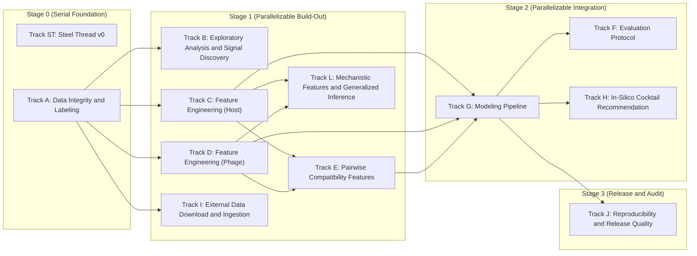

# Lyzor Tx In-Silico Pipeline Plan

## Parallel Execution View

- Tracks in the same stage box can run in parallel unless blocked by their own incoming dependencies.

## Track ST: Steel Thread v0

- **Guiding Principle:** Prove end-to-end viability with a minimal but honest pipeline using internal data only.
- [x] **ST01** Define v0 label policy and uncertainty flags from raw interactions. Implemented in
      `lyzortx/pipeline/steel_thread_v0/steps/st01_label_policy.py`. Regression baseline:
      `lyzortx/pipeline/steel_thread_v0/baselines/st01_expected_metrics.json`.
- [x] **ST01B** Add strict confidence tiering as a parallel output from ST0.1 to support dual-slice evaluation.
      Implemented in `lyzortx/pipeline/steel_thread_v0/steps/st01b_confidence_tiers.py`. Regression baseline:
      `lyzortx/pipeline/steel_thread_v0/baselines/st01b_expected_metrics.json`.
- [x] **ST02** Build one canonical pair table with IDs, labels, uncertainty, and v0 feature blocks. Implemented in
      `lyzortx/pipeline/steel_thread_v0/steps/st02_build_pair_table.py`. Regression baseline:
      `lyzortx/pipeline/steel_thread_v0/baselines/st02_expected_metrics.json`.
- [x] **ST03** Lock one leakage-safe split protocol and one fixed holdout benchmark for v0. Implemented in
      `lyzortx/pipeline/steel_thread_v0/steps/st03_build_splits.py`. Regression baseline:
      `lyzortx/pipeline/steel_thread_v0/baselines/st03_expected_metrics.json`.
- [x] **ST04** Train one strong tabular baseline and one simple comparator baseline. Implemented in
      `lyzortx/pipeline/steel_thread_v0/steps/st04_train_baselines.py`. Regression baseline:
      `lyzortx/pipeline/steel_thread_v0/baselines/st04_expected_metrics.json`.
- [x] **ST05** Calibrate probabilities and export ranked per-strain phage predictions. Implemented in
      `lyzortx/pipeline/steel_thread_v0/steps/st05_calibrate_rank.py`. Regression baseline:
      `lyzortx/pipeline/steel_thread_v0/baselines/st05_expected_metrics.json`.
- [x] **ST06** Generate top-3 recommendations with policy-tuned defaults. Implemented in
      `lyzortx/pipeline/steel_thread_v0/steps/st06_recommend_top3.py`. Regression baseline:
      `lyzortx/pipeline/steel_thread_v0/baselines/st06_expected_metrics.json`.
- [x] **ST06B** Compare ranking policy variants to avoid recommendation-policy regressions. Implemented in
      `lyzortx/pipeline/steel_thread_v0/steps/st06b_compare_ranking_policies.py`.
- [x] **ST07** Emit one reproducible report to generated_outputs/steel_thread_v0/. Implemented in
      `lyzortx/pipeline/steel_thread_v0/steps/st07_build_report.py`. Regression baseline:
      `lyzortx/pipeline/steel_thread_v0/baselines/st07_expected_metrics.json`.
- [x] **ST08** Add dual-slice reporting (full-label and strict-confidence) to ST0.7
  - ST0.7 report includes separate metric rows for full-label and strict-confidence slices
  - Both slices report top-3 hit rate, calibration ECE, and Brier score
- [x] **ST09** Document failure case hypotheses for each major holdout miss error bucket
  - Each holdout miss strain in error_analysis.csv has at least one documented hypothesis
  - Hypotheses are written to the track lab notebook with actionable next steps

## Track A: Data Integrity and Labeling

- **Guiding Principle:** Canonical IDs, label policies, cohort contracts, and replicate-aware label sets from raw data.
- [x] **TA01** Build a canonical ID map for bacteria and phages across all tables. Implemented in
      `lyzortx/generated_outputs/track_a/id_map/{bacteria_id_map.csv,phage_id_map.csv}`.
- [x] **TA02** Resolve naming/alias mismatches (for example legacy phage names). Implemented in
      `lyzortx/generated_outputs/track_a/id_map/{bacteria_alias_resolution.csv,phage_alias_resolution.csv}`.
- [x] **TA03** Add automated data integrity checks for row/column consistency. Implemented in
      `lyzortx/pipeline/track_a/checks/check_track_a_integrity.py`.
- [x] **TA04** Define and document handling policy for uninterpretable labels (score='n'). Implemented in
      `lyzortx/generated_outputs/track_a/labels/{label_set_v1_policy.json,label_set_v2_policy.json}`.
- [x] **TA05** Add plaque-image-assisted QC pass for ambiguous/conflicting pairs. Implemented in
      `lyzortx/generated_outputs/track_a/qc/{plaque_image_qc_queue.csv,plaque_image_qc_summary.json}`.
- [x] **TA06** Define cohort contracts and denominator rules for all reports. Implemented in
      `lyzortx/generated_outputs/track_a/cohort/{cohort_contracts.csv,cohort_contracts.json}`.
- [x] **TA07** Preserve replicate and dilution structure in intermediate tables. Implemented in
      `lyzortx/generated_outputs/track_a/labels/track_a_observations_with_ids.csv`.
- [x] **TA08** Create label set v1: any_lysis, lysis_strength, dilution_potency, uncertainty_flags. Implemented in
      `lyzortx/generated_outputs/track_a/labels/label_set_v1_pairs.csv`.
- [x] **TA09** Create label set v2 with alternative aggregation assumptions and compare impact. Implemented in
      `lyzortx/generated_outputs/track_a/labels/{label_set_v2_pairs.csv,label_set_v1_v2_comparison.csv}`.
- [x] **TA10** Add scripts that regenerate all derived labels from raw data in one command. Implemented in
      `lyzortx/pipeline/track_a/run_track_a.py`.
- [x] **TA11** Fix label policy for borderline matrix_score=0 pairs. Model: `gpt-5.4-mini`.
  - Identify the 2557 pairs where aux_matrix_score_0_to_4=0 but label_hard_any_lysis=1 (single-replicate noise
    positives)
  - Add a label_v3 policy that sets label_hard_any_lysis=0 for these pairs, or add a training weight that downweights
    them
  - Retrain the locked v1 model with the corrected labels and report AUC, top-3, Brier delta
  - VHRdb analysis showed +3.1pp top-3 from downweighting these pairs, so expect a similar improvement
  - Document the label policy change in the Track A lab notebook

## Track B: Exploratory Analysis and Signal Discovery

- **Guiding Principle:** Profile interactions, identify hard-to-lyse strains, rescuer phages, and dilution-response
  patterns.
- [x] **TB01** Profile raw interaction matrix composition and replicate consistency
- [x] **TB02** Quantify morphotype breadth and narrow-susceptibility patterns
- [x] **TB03** Characterize hard-to-lyse strains by known host traits
  - Identify strains with zero or very few lytic phages in the interaction matrix
  - Report which host metadata fields (serotype, phylogroup, ST) correlate with low susceptibility
  - Output a summary CSV and findings in the track lab notebook
- [x] **TB04** Characterize rescuer phages for narrow-susceptibility strains
- [x] **TB05** Analyze dilution-response patterns per phage and per bacterial subgroup

## Track C: Feature Engineering (Host)

- **Guiding Principle:** Defense-system subtypes, OMP receptor variants, capsule/LPS detail, and phylogenomic embeddings
  for host strains.
- [x] **TC01** Build defense-system subtype feature block from defense_finder annotations
  - Ingest 370+host_defense_systems_subtypes.csv (138 subtype columns, 404 strains)
  - Variance filter drops subtypes present in <5 or >395 strains
  - Derived features include defense diversity, CRISPR presence, Abi burden
  - Output CSV joinable on bacteria column with ~60-80 informative features
- [x] **TC02** Build OMP receptor variant feature block from BLAST cluster assignments
  - Ingest blast_results_cured_clusters=99_wide.tsv (12 receptor proteins, 404 strains)
  - Encode cluster IDs as categoricals (one-hot top-k, group rare clusters)
  - Output CSV joinable on bacteria column with ~20 receptor features
- [x] **TC03** Build extended host surface features (capsule detail, LPS core, UMAP embeddings)
  - Add Klebsiella-type capsule, LPS core type, and 8D UMAP phylogenomic embeddings
  - All features joinable on bacteria column
  - Missingness indicators added for features with incomplete coverage
- [x] **TC04** Integrate host feature blocks into v1 pair table
  - All host feature blocks merged into a single host feature matrix
  - Join completeness verified (no unexpected NaN increase vs source data)
  - Quick LightGBM sanity check on training fold confirms lift over v0

## Track D: Feature Engineering (Phage)

- **Guiding Principle:** RBP features, genome k-mer embeddings, and phage distance embeddings from existing genomic
  data.
- [x] **TD01** Build RBP feature block from RBP_list.csv annotations
  - Parse per-phage RBP count, has_fiber, has_spike, RBP type composition
  - Handle NAs with indicator features for missing RBP annotations
  - Output CSV joinable on phage column with ~5-8 features
- [x] **TD02** Build genome k-mer embedding features from phage FNA files
  - Compute tetranucleotide (k=4) frequency vectors from 97 FNA genomes
  - Reduce via SVD to 20-30 dimensions
  - Add GC content and continuous genome length
  - Output CSV joinable on phage column with ~25-30 features
- [x] **TD03** Build phage distance embedding from VIRIDIC phylogenetic tree
  - Extract pairwise distances from 96_viridic_distance_phylogenetic_tree_algo=upgma.nwk
  - Compute MDS embedding to 5-8 dimensions
  - Output CSV joinable on phage column

## Track E: Pairwise Compatibility Features

- **Guiding Principle:** RBP-receptor compatibility, defense evasion proxy, and phylogenetic distance features that
  break the popular-phage bias.
- [x] **TE01** Build RBP-receptor compatibility features from curated genus-receptor lookup
  - Curated lookup mapping phage genus/subfamily to known primary receptor targets
  - Per-pair features include target_receptor_present, receptor_cluster_matches,
    receptor_variant_seen_in_training_positives
  - Output CSV joinable on bacteria+phage pair with ~5-8 features
- [x] **TE02** Build defense evasion proxy features from training-fold collaborative filtering
  - For each phage family, compute average lysis rate against each defense subtype from training data only
  - Per-pair expected evasion score computed as sum of phage family success rates against host defense systems
  - Leakage verified by computing on training fold only, never holdout
- [x] **TE03** Build phylogenetic distance to isolation host features
  - UMAP Euclidean distance between target host and phage isolation host
  - Defense Jaccard distance between target host and phage isolation host
  - Output CSV joinable on bacteria+phage pair with ~3-4 features

## Track F: Evaluation Protocol

- **Guiding Principle:** Lock v1 benchmark split and add bootstrap confidence intervals. ST03 already provides
  leakage-safe host-group and phage-family holdouts. TF01/TF02 are done but their metrics are invalidated by the
  label-leakage fix — they will be re-run as part of TG06.
- [x] **TF01** Lock ST03 split as v1 benchmark and add bootstrap CIs for all metrics. Model: `gpt-5.4-mini`.
  - Existing ST03 split locked as the canonical v1 evaluation protocol
  - Bootstrap CIs (1000 resamples of holdout strains) for top-3 hit rate, AUC, Brier score, and ECE
  - Dual-slice reporting (full-label and strict-confidence) for all metrics
- [x] **TF02** Before/after comparison of v0 vs v1 with error bucket analysis. Model: `gpt-5.4-mini`.
  - Side-by-side metrics table for v0 (metadata logreg) vs v1 (genomic GBM)
  - Error bucket analysis showing which v0 holdout misses v1 fixed and why
  - Honest reporting of strains that remain unpredictable

## Track G: Modeling Pipeline

- **Guiding Principle:** LightGBM model on expanded genomic features with calibration, ablation, and SHAP
  interpretation.
- [x] **TG01** Train LightGBM binary classifier on v1 expanded feature set
  - LightGBM with hyperparameter tuning via 5-fold CV on existing leakage-safe cv_groups
  - Logistic regression kept as interpretable comparator
  - Target AUC 0.87-0.90 and top-3 hit rate 90%+
- [x] **TG02** Calibrate GBM outputs with isotonic and Platt scaling
  - Same calibration approach as ST05 applied to GBM
  - Report ECE, Brier, log-loss for both calibration methods
  - Target ECE < 0.03 on full-label
- [x] **TG03** Run feature-block ablation suite proving which features deliver lift
  - Ablation arms: v0 features only, +defense subtypes, +OMP receptors, +phage genomic, +pairwise compatibility, all
    features
  - Each arm reports AUC, top-3 hit rate, Brier on same holdout split
  - v0 baseline is reference point in all comparisons
- [x] **TG04** Compute SHAP explanations for per-pair and global feature importance. Model: `gpt-5.4`.
  - TreeExplainer SHAP values for GBM model
  - Per-pair explanations answering why each phage was recommended for each strain
  - Global feature importance ranking across the panel
  - Per-strain summary of what makes each strain hard or easy to predict
  - Concrete recommendation of which feature blocks to keep in final v1 model, based on SHAP evidence and TG03 ablation
    results
- [x] **TG05** Run feature-subset sweep to find best block combination for top-3 ranking. Model: `gpt-5.4`.
  - Train models on all 2-block and 3-block combinations of the 4 new feature blocks (defense, OMP, phage-genomic,
    pairwise)
  - Reuse the TG01 winning hyperparameters for all sweep arms — do NOT run per-arm hyperparameter search. The goal is to
    isolate the feature-block effect, not confound it with per-arm tuning differences.
  - Report top-3 hit rate, AUC, and Brier on the same ST03 holdout for each combo
  - Identify the winning subset that maximizes top-3 hit rate without degrading AUC
  - Compare winning subset against the TG01 all-features model
  - Include a deployment-realistic arm that excludes all features derived from training labels
    (legacy_label_breadth_count, legacy_receptor_support_count) to measure generalization to truly novel strains
  - Report both panel-evaluation and deployment-realistic metrics for the winning configuration
  - Lock the final v1 feature configuration for downstream Track F and H
- [x] **TG06** Delete label-leaked features from the feature pipeline. Model: `gpt-5.4-mini`.
  - Remove legacy_label_breadth_count: delete the (n_infections, legacy_label_breadth_count) rename in
    st02_build_pair_table.py and drop the column from ST02 output
  - Remove legacy_receptor_support_count: delete its construction in build_rbp_receptor_compatibility_feature_block.py
    (Track E) and drop it from the TE01 output schema
  - Remove the LABEL_DERIVED_COLUMNS list in run_feature_subset_sweep.py and the deployment-realistic arm logic that
    depends on it
  - Delete v1_config_keys.py and simplify v1_feature_configuration.json to a single flat feature config (no
    panel_default vs deployment_realistic_sensitivity split)
  - Grep the entire lyzortx/ tree for legacy_label_breadth_count and legacy_receptor_support_count — zero hits must
    remain
  - All existing tests pass after deletions
- [x] **TG07** Retrain, recalibrate, and re-run SHAP and ablation on the clean feature set. Model: `gpt-5.4-mini`.
  - Retrain LightGBM on the clean feature set (reuse TG01 hyperparameters)
  - Recalibrate (isotonic + Platt) and report AUC, top-3, Brier, ECE
  - Re-run SHAP explanations on the clean model
  - Re-run feature-block ablation on the clean feature set
  - Update v1_feature_configuration.json with the clean model metrics
- [x] **TG08** Re-run downstream tracks and verify end-to-end pipeline. Model: `gpt-5.4-mini`.
  - Re-run explained recommendations (Track H) against clean model outputs
  - Re-run v0-vs-v1 evaluation (Track F) against clean model metrics
  - Run python -m lyzortx.pipeline.track_j.run_track_j end-to-end and verify it completes without error on the clean
    pipeline
  - The old label-leaked metrics must not appear in any output
- [x] **TG09** Fix LightGBM determinism and lock defense + phage_genomic as v1 winner. Model: `gpt-5.4-mini`.
  - Add deterministic=True to make_lightgbm_estimator in train_v1_binary_classifier.py
  - Remove n_jobs=1 from make_lightgbm_estimator (deterministic=True handles thread safety, force_col_wise=True is
    already set)
  - Update v1_feature_configuration.json to lock defense + phage_genomic as the winner (exclude pairwise block — 5 of 13
    features are training-label-derived)
  - Remove the feature-subset-sweep step from Track J's run_track_j.py so the lock file is treated as a human decision,
    not a regenerated output
  - Verify two consecutive runs of run_track_g.py --step train-v1-binary produce identical outputs
- [x] **TG10** Re-run downstream tracks on the stable 2-block lock. Model: `gpt-5.4-mini`.
  - Re-run Track H explained recommendations against the 2-block model outputs
  - Re-run Track F v0-vs-v1 evaluation against the 2-block model metrics
  - Run python -m lyzortx.pipeline.track_j.run_track_j end-to-end and verify it completes without error
  - Verify v1_feature_configuration.json is unchanged after the Track J run (sweep no longer regenerates it)
- [x] **TG11** Investigate non-leaky features that close the calibration gap. Model: `gpt-5.4`.
  - Pairwise soft leakage context: TE02 defense_evasion_* features (4) and TE01
    receptor_variant_seen_in_training_positives (1) are training-label-derived via collaborative filtering. Do not
    include these in candidate features.
  - Clean pairwise candidates to evaluate individually: TE03 isolation_host distances (2 features) and TE01 curated
    lookup features (lookup_available, target_receptor_present, protein_target_present, surface_target_present,
    receptor_cluster_matches)
  - Propose and test at least two candidate features (from clean pairwise or other sources) that do not leak training
    labels
  - Report whether any candidate recovers >50% of the AUC gap between the 2-block model (~0.837) and the old leaked
    model (~0.911) without degrading top-3
  - If no candidate closes the gap, accept the 2-block calibration as the honest v1 baseline
- [x] **TG12** Delete soft-leaky training-label-derived features from Track E code. Model: `gpt-5.4-mini`.
  - Delete the legacy soft-leaky pairwise block from Track E code
  - Remove the exact-variant training-positive flag from the RBP-receptor compatibility block
  - Update downstream tests that assert on removed columns
  - Grep lyzortx/ for the removed pairwise feature names — zero hits outside lab notebooks
  - All existing tests pass after deletions

## Track H: In-Silico Cocktail Recommendation

- **Guiding Principle:** Top-k recommendations with SHAP-based explanations. TH01/TH02 are done but will be re-run as
  part of TG06 against the clean model.
- [x] **TH01** Benchmark policy variants for top-k recommendation and lock a non-regressing default
- [x] **TH02** Add explained recommendations with calibrated P(lysis), CI, and SHAP features. Model: `gpt-5.4-mini`.
  - Each top-3 recommendation includes calibrated P(lysis), 95% CI, and top-3 SHAP features
  - Output format suitable for clinician or CDMO operator review
  - Report covers all holdout strains

## Track I: External Data Download and Ingestion

- **Guiding Principle:** Download and ingest external phage-host interaction data from public sources. TI07-TI10
  (confidence tiers, training cohorts, ablations, lift analysis) were deleted — external data has zero overlap with the
  internal panel for training. See v1 archive for historical Track K lift measurement results.
- [x] **TI01** Create a curated reading list of closely related phage-host prediction papers. Implemented in
      `lyzortx/research_notes/LITERATURE.md`.
- [x] **TI02** Build source_registry.csv for all external sources. Implemented in
      `lyzortx/research_notes/external_data/source_registry.csv`.
- [x] **TI03** Download and ingest VHRdb pairs with source-fidelity fields. Model: `gpt-5.4`.
  - Download VHRdb data from https://phage.ee.cityu.edu.hk/ into lyzortx/generated_outputs/track_i/tier_a_ingest/
  - Output CSV contains >0 real bacteria-phage pairs
  - Each row preserves raw global_response and datasource_response without case folding
  - source_datasource_id, source_disagreement_flag, and source_native_record_id populated
  - Raise FileNotFoundError or request error on download failure, never silently skip
- [x] **TI04** Download and ingest Tier A sources: BASEL, KlebPhaCol, GPB. Model: `gpt-5.4`.
  - Download BASEL from publication supplement, KlebPhaCol from https://klebphacol.com/, GPB from https://phagebank.org/
  - Each source produces an ingested CSV with >0 rows under lyzortx/generated_outputs/track_i/tier_a_ingest/
  - All rows carry source_system provenance
  - Raise on download failure, do not silently produce empty output
- [x] **TI05** Harmonize Tier A datasets to internal schema. Model: `gpt-5.4`.
  - Map external bacteria and phage names to canonical IDs via Track A alias resolution
  - Report how many external pairs overlap with the internal 404x96 panel vs are novel
  - Output a harmonized pair table with >0 rows joinable on pair_id
  - Raise ValueError if harmonization produces zero joinable rows
- [x] **TI06** Download and ingest Tier B: Virus-Host DB and NCBI BioSample metadata. Model: `gpt-5.4`.
  - Download Virus-Host DB associations from https://www.genome.jp/virushostdb/
  - Download NCBI Virus/BioSample metadata via Entrez API
  - Each source produces an ingested CSV with >0 rows
  - BioSample host_disease and isolation_host fields parsed from XML attributes
  - Raise on empty API responses or download failures

## Track L: Mechanistic Features and Generalized Inference

- **Guiding Principle:** Two goals: (1) Replace deleted label-derived pairwise features (Track E) with annotation-based
  mechanistic features from Pharokka. (2) Build a generalized inference pipeline that accepts arbitrary E. coli genomes
  and phage FNA files, computes features from sequence, and predicts lysis — removing the hard dependency on the fixed
  404-strain panel.
- [x] **TL01** Annotate all 97 phage genomes with Pharokka. Model: `gpt-5.4-mini`.
  - Add bioconda dependencies (pharokka, mmseqs2, trnascan-se, minced, aragorn, mash, dnaapler) to environment.yml and
    verify pharokka runs in CI
  - Run Pharokka on all 97 FNA files in data/genomics/phages/FNA/
  - Store annotations under lyzortx/generated_outputs/track_l/pharokka_annotations/
  - Parse the CDS functional annotations into a per-phage summary table with counts by PHROGs category (tail, lysis,
    defense, etc.)
  - Extract per-phage RBP gene list with functional family annotations
  - Extract per-phage anti-defense gene list (anti-restriction, anti-CRISPR, etc.)
  - All 97 phages must produce >0 annotated CDS
- [x] **TL02** Build annotation-interaction enrichment module and run PHROG x receptor/defense analysis. Model:
      `gpt-5.4`.
  - Build a reusable enrichment module (annotation_interaction_enrichment.py) that takes any (phage binary feature
    matrix, host binary feature matrix, interaction matrix) and produces a Fisher's exact test enrichment table with
    odds ratios, p-values, and Benjamini-Hochberg corrected significance
  - Run three enrichment analyses: (1) RBP PHROG IDs (43) x OMP receptor variant clusters (22), (2) RBP PHROG IDs (43) x
    LPS core type (~5), (3) anti-defense gene PHROG IDs x defense system subtypes (82)
  - Each analysis uses the full interaction matrix (positive and negative outcomes), not just generalist/specialist
    tails
  - Output enrichment tables as CSVs under lyzortx/generated_outputs/track_l/enrichment/
  - Document which PHROG-receptor and PHROG-defense associations are significant (BH-corrected p < 0.05) in the track_L
    lab notebook
  - These results directly inform whether TL03 builds pairwise features from the learned associations or falls back to
    the PHROG binary matrix
- [x] **TL03** Build mechanistic RBP-receptor compatibility features from annotations. Model: `gpt-5.4`.
  - Collapse duplicate PHROG carrier profiles before feature construction (32 PHROGs reduce to ~25 unique profiles due
    to co-occurrence groups like 136/15437/4465/9017 and 1002/1154/967/972)
  - Use TL02 enrichment results (380 significant RBP PHROG x OMP/LPS associations) to build pairwise features for each
    phage-host pair — use lysis_rate_diff from the enrichment CSV as feature weights (better-behaved than odds ratios)
  - Also include the phage x RBP-PHROG binary matrix (collapsed to unique profiles) as a direct phage-level feature
    block
  - Features must be derived from genome annotations only, not from training labels
  - Output CSV joinable on bacteria+phage pair
  - Compare against the existing RBP_list.csv curated annotations as a sanity check
- [x] **TL04** Build mechanistic defense-evasion features from annotations. Model: `gpt-5.4`.
  - Use TL02 enrichment results to build pairwise features for each phage-host pair — does the phage encode anti-defense
    genes whose PHROG families are significantly associated with lysis of hosts carrying specific defense systems?
  - Features must be derived from Pharokka anti-defense annotations, not from training label collaborative filtering
  - Output CSV joinable on bacteria+phage pair
  - Caveat: TL02 found only 27 significant anti-defense x defense associations (2.9%), weaker than the RBP-receptor
    signal. Generic methyltransferase annotations inflate the anti-defense gene set. Treat these as experimental
    candidates — include in TL05 evaluation as a separate optional block
- [ ] **TL05** Retrain v1 model with mechanistic pairwise features and measure lift. Model: `gpt-5.4-mini`.
  - Evaluate TL03 (RBP-receptor) and TL04 (defense-evasion) features separately, not as a bundle — TL04 signal is weaker
    and may hurt rather than help
  - Add features to the locked defense + phage_genomic baseline
  - Retrain with TG01 hyperparameters on the ST03 holdout split
  - Report AUC, top-3, Brier delta vs the current locked baseline for each feature block independently and combined
  - If mechanistic features improve metrics, propose a new locked v1 config
  - Run SHAP on the new model to verify mechanistic features contribute signal
- [ ] **TL06** Persist fitted transforms for novel-organism feature projection. Model: `gpt-5.4-mini`.
  - Save the TD02 fitted TruncatedSVD object via joblib alongside the k-mer feature CSV so novel phage FNAs can be
    projected into the existing 24-dim embedding
  - Save the TC01 defense subtype column mask (variance filter thresholds and ordered column list) so novel Defense
    Finder outputs map to the same 79 feature columns
  - Add project_novel_phage(fna_path, svd_path) function that computes tetranucleotide frequencies + GC + genome length
    and returns the model-ready phage feature vector
  - Add project_novel_host(defense_finder_output_path, column_mask_path) function that parses Defense Finder output into
    the model-ready host feature vector
  - Round-trip test on one panel phage and one panel host confirms output matches the pre-computed feature table within
    floating-point tolerance
- [ ] **TL07** Build Defense Finder runner for novel E. coli genomes. Model: `gpt-5.4`.
  - Input is a genome assembly FASTA file for a novel E. coli strain
  - Pipeline runs Pyrodigal for gene prediction then Defense Finder for defense system annotation
  - Output is parsed into the same 79-column defense subtype vector the locked model expects, using the column mask from
    TL06
  - Add defense-finder to environment.yml (pip-installable via PyPI)
  - Test by running on one publicly available E. coli genome (e.g., K-12 MG1655) and verifying >0 defense systems
    detected
  - End-to-end test confirms the output vector has the correct shape and column names matching the training feature set
- [ ] **TL08** Build generalized inference function for arbitrary genomes. Model: `gpt-5.4`.
  - Function signature: infer(host_genome_path, phage_fna_paths, model_path) returning DataFrame with columns phage,
    p_lysis, rank
  - Computes host defense features via TL07 runner
  - Computes phage k-mer features via TL06 saved SVD transform
  - Creates cross-product of (1 host x N phages), scores with trained LightGBM, applies isotonic calibration, ranks by
    calibrated probability
  - No dependency on the static pair table or the 404-strain panel metadata
  - Integration test using one panel strain genome reproduces the locked model predictions for that strain within
    calibration tolerance
- [ ] **TL09** Validate generalized inference on Virus-Host DB positive pairs. Model: `gpt-5.4`.
  - Mine Virus-Host DB for E. coli strain-level hosts (tax_id != 562) with phage genome accessions on NCBI — expect ~70
    strains, ~900 phage genomes, ~500 positive pairs
  - Download genome assemblies from NCBI for at least 10 novel hosts (strains not in the 404 training panel) that each
    have >=5 associated phage genomes
  - Download the associated phage genome FNA files from NCBI
  - Run the TL08 generalized inference function on each novel host x its associated phages plus the 96 panel phages
    (rank known-positive phages against the full union of panel + VHdb phages for that host)
  - Positive-only validation metrics: (a) median predicted P(lysis) for known positive pairs — expect significantly
    above the population base rate of ~30%, (b) for each host, rank of known-positive phages among all candidate phages
    in the union set — expect above-median rank, (c) calibration check — predicted P(lysis) for known positives should
    be higher than for random host-phage pairs from the same union set
  - Also run on panel hosts that appear in VHdb (e.g., LF82, EDL933, 55989) as a round-trip sanity check — predictions
    from genome-derived features should match the pair-table path
  - Document limitations in lab notebook — these are positive-only pairs (no negatives), so AUC and top-3 hit rate
    cannot be computed

## Track J: Reproducibility and Release Quality

- **Guiding Principle:** One-command regeneration and environment freezing for v1 pipeline. TJ01/TJ02 are done but must
  be re-verified after TG06 retrains the clean model.
- [x] **TJ01** One command to regenerate all v1 outputs from raw data. Model: `gpt-5.4-mini`.
  - Single entry point regenerates feature blocks, model, calibration, recommendations, and report
  - Runs without error on a fresh clone with only phage_env dependencies
- [x] **TJ02** Freeze environment specs and seeds for v1 benchmark run. Model: `gpt-5.4-mini`.
  - requirements.txt and phage_env environment spec locked for exact versions used
  - Random seeds documented for reproducible model training
