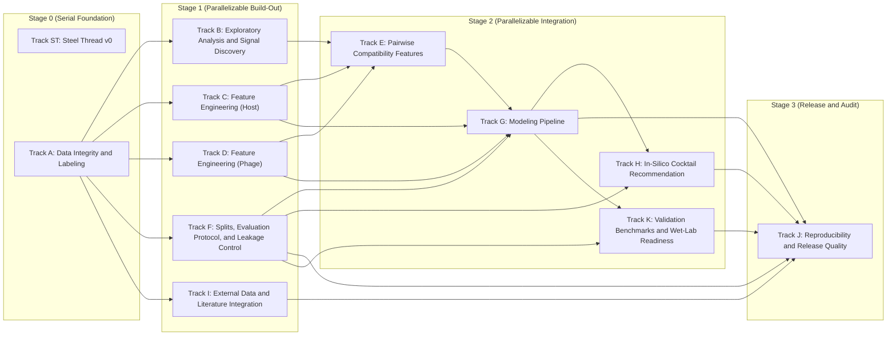

# Lyzor Tx In-Silico Pipeline Plan

## Parallel Execution View

- Tracks in the same stage box can run in parallel unless blocked by their own incoming dependencies.

## Track ST: Steel Thread v0

- **Guiding Principle:** Prove end-to-end viability with a minimal but honest pipeline using internal data only.
- [x] Define v0 label policy and uncertainty flags from raw interactions. Implemented in
      `lyzortx/pipeline/steel_thread_v0/steps/st01_label_policy.py`. Regression baseline:
      `lyzortx/pipeline/steel_thread_v0/baselines/st01_expected_metrics.json`.
- [x] Add strict confidence tiering as a parallel output from ST0.1 to support dual-slice evaluation. Implemented in
      `lyzortx/pipeline/steel_thread_v0/steps/st01b_confidence_tiers.py`. Regression baseline:
      `lyzortx/pipeline/steel_thread_v0/baselines/st01b_expected_metrics.json`.
- [x] Build one canonical pair table with IDs, labels, uncertainty, and v0 feature blocks. Implemented in
      `lyzortx/pipeline/steel_thread_v0/steps/st02_build_pair_table.py`. Regression baseline:
      `lyzortx/pipeline/steel_thread_v0/baselines/st02_expected_metrics.json`.
- [x] Lock one leakage-safe split protocol and one fixed holdout benchmark for v0. Implemented in
      `lyzortx/pipeline/steel_thread_v0/steps/st03_build_splits.py`. Regression baseline:
      `lyzortx/pipeline/steel_thread_v0/baselines/st03_expected_metrics.json`.
- [x] Train one strong tabular baseline and one simple comparator baseline. Implemented in
      `lyzortx/pipeline/steel_thread_v0/steps/st04_train_baselines.py`. Regression baseline:
      `lyzortx/pipeline/steel_thread_v0/baselines/st04_expected_metrics.json`.
- [x] Calibrate probabilities and export ranked per-strain phage predictions. Implemented in
      `lyzortx/pipeline/steel_thread_v0/steps/st05_calibrate_rank.py`. Regression baseline:
      `lyzortx/pipeline/steel_thread_v0/baselines/st05_expected_metrics.json`.
- [x] Generate top-3 recommendations with policy-tuned defaults. Implemented in
      `lyzortx/pipeline/steel_thread_v0/steps/st06_recommend_top3.py`. Regression baseline:
      `lyzortx/pipeline/steel_thread_v0/baselines/st06_expected_metrics.json`.
- [x] Compare ranking policy variants to avoid recommendation-policy regressions. Implemented in
      `lyzortx/pipeline/steel_thread_v0/steps/st06b_compare_ranking_policies.py`.
- [x] Emit one reproducible report to generated_outputs/steel_thread_v0/. Implemented in
      `lyzortx/pipeline/steel_thread_v0/steps/st07_build_report.py`. Regression baseline:
      `lyzortx/pipeline/steel_thread_v0/baselines/st07_expected_metrics.json`.
- [x] Add dual-slice reporting (full-label and strict-confidence) to ST0.7
- [x] Document failure case hypotheses for each major holdout miss error bucket

## Track A: Data Integrity and Labeling

- **Guiding Principle:** Canonical IDs, label policies, cohort contracts, and replicate-aware label sets from raw data.
- [x] Build a canonical ID map for bacteria and phages across all tables. Implemented in
      `lyzortx/generated_outputs/track_a/id_map/{bacteria_id_map.csv,phage_id_map.csv}`.
- [x] Resolve naming/alias mismatches (for example legacy phage names). Implemented in
      `lyzortx/generated_outputs/track_a/id_map/{bacteria_alias_resolution.csv,phage_alias_resolution.csv}`.
- [x] Add automated data integrity checks for row/column consistency. Implemented in
      `lyzortx/pipeline/track_a/checks/check_track_a_integrity.py`.
- [x] Define and document handling policy for uninterpretable labels (score='n'). Implemented in
      `lyzortx/generated_outputs/track_a/labels/{label_set_v1_policy.json,label_set_v2_policy.json}`.
- [x] Add plaque-image-assisted QC pass for ambiguous/conflicting pairs. Implemented in
      `lyzortx/generated_outputs/track_a/qc/{plaque_image_qc_queue.csv,plaque_image_qc_summary.json}`.
- [x] Define cohort contracts and denominator rules for all reports. Implemented in
      `lyzortx/generated_outputs/track_a/cohort/{cohort_contracts.csv,cohort_contracts.json}`.
- [x] Preserve replicate and dilution structure in intermediate tables. Implemented in
      `lyzortx/generated_outputs/track_a/labels/track_a_observations_with_ids.csv`.
- [x] Create label set v1: any_lysis, lysis_strength, dilution_potency, uncertainty_flags. Implemented in
      `lyzortx/generated_outputs/track_a/labels/label_set_v1_pairs.csv`.
- [x] Create label set v2 with alternative aggregation assumptions and compare impact. Implemented in
      `lyzortx/generated_outputs/track_a/labels/{label_set_v2_pairs.csv,label_set_v1_v2_comparison.csv}`.
- [x] Add scripts that regenerate all derived labels from raw data in one command. Implemented in
      `lyzortx/pipeline/track_a/run_track_a.py`.

## Track B: Exploratory Analysis and Signal Discovery

- **Guiding Principle:** Profile interactions, identify hard-to-lyse strains, rescuer phages, and uncertainty hotspots.
- [x] Profile raw interaction matrix composition and replicate consistency
- [x] Quantify morphotype breadth and narrow-susceptibility patterns
- [x] Characterize hard-to-lyse strains by known host traits
- [ ] Characterize rescuer phages for narrow-susceptibility strains
- [ ] Analyze dilution-response patterns per phage and per bacterial subgroup
- [ ] Build uncertainty map: where annotation conflicts are concentrated
- [ ] Prioritize candidate mechanistic feature hypotheses from EDA findings

## Track C: Feature Engineering (Host)

- **Guiding Principle:** Receptor/surface features, defense-system context, phylogeny-aware embeddings for host strains.
- [ ] Build receptor/surface feature block: O/K/LPS-related loci and known receptor proxies
- [ ] Add outer membrane receptor variant features
- [ ] Encode phylogeny-aware host embeddings with leakage-safe generation
- [ ] Build defense-system context block (presence, subtype, burden, co-occurrence)
- [ ] Add missingness indicators and confidence scores for host features
- [ ] Version host feature matrix with schema and provenance manifest

## Track D: Feature Engineering (Phage)

- **Guiding Principle:** RBP/depolymerase features, structure-aware embeddings, phage architecture and taxonomy signals.
- [ ] Build phage sequence processing pipeline from genome/protein files
- [ ] Extract RBP/depolymerase/domain features (HMM/domain and structure-aware proxies)
- [ ] Pilot structure-aware RBP embeddings (PHIStruct-style) for low-similarity generalization
- [ ] Build phage protein family embeddings or pangenome cluster features
- [ ] Add phage architecture/taxonomy/module features
- [ ] Add isolation-host and lineage priors as weak features (not dominant)
- [ ] Version phage feature matrix with schema and provenance manifest

## Track E: Pairwise Compatibility Features

- **Guiding Principle:** RBP-vs-receptor compatibility scores, domain-level interactions, and uncertainty-aware pair
  features.
- [ ] Design phage-host compatibility features (RBP family vs host receptor proxies)
- [ ] Add domain-level compatibility scores
- [ ] Add feature interactions for adsorption-relevant host/phage pairs
- [ ] Add uncertainty-aware pairwise features (confidence-weighted signals)

## Track F: Splits, Evaluation Protocol, and Leakage Control

- **Guiding Principle:** Leakage-safe splits, grouped CV, bootstrap CIs, source-aware evaluation, and Tier 1/2
  benchmarks.
- [ ] Define fixed split protocol: leave-cluster-out host splits and phage-clade holdouts
- [ ] Keep a strict untouched external test benchmark for final validation
- [ ] Add leakage checks for all split strategies
- [ ] Add LOGOCV-style grouped validation and mean-hit-ratio@k reporting
- [ ] Add bootstrap confidence intervals for strain-level top-k metrics
- [ ] Add dual-slice reporting for all benchmarks: full-label and strict-confidence
- [ ] Add source-aware evaluation: leave-one-datasource-out and cross-source transfer benchmarks
- [ ] Add source-aware leakage checks across datasource boundaries
- [ ] Add pre-Tier-1 progress gates (delta vs locked ST0.6 baseline)
- [ ] Define Tier 1 (current-panel feasible) benchmark suite
- [ ] Define Tier 2 (north-star) benchmark suite
- [ ] Add benchmark report template for fair model-to-model comparison

## Track G: Modeling Pipeline

- **Guiding Principle:** A "meaningful model" for this project is one that produces a calibrated probability of lysis
  for any given phage-bacterium pair, enabling nuanced downstream cocktail recommendations.
- [ ] Baseline 1: strong tabular binary model on existing host-only features
- [ ] Baseline 2: joint host+phage feature model without pairwise interactions
- [ ] Milestone G0: ship calibrated Baseline 2 with leakage-safe protocol
- [ ] Milestone G0.1: ship receptor-first enriched baseline
- [ ] External-data training order: internal-only -> +Tier A -> +Tier B
- [ ] Stretch: Stage A model P(adsorption) from host-surface + phage-RBP + compatibility features
- [ ] Stretch: Stage B model P(productive_lysis | adsorption) from post-entry features
- [ ] Stretch: compose P(lysis) = P(adsorption) * P(productive_lysis | adsorption)
- [ ] Add multi-task formulation for binary + strength + potency targets
- [ ] Add calibrated outputs (isotonic/Platt) and uncertainty intervals
- [ ] Add label-noise-aware training variants
- [ ] Add ablation matrix: host-only, phage-only, pairwise-only, and no-identity controls
- [ ] Add robust handling of class imbalance and label uncertainty
- [ ] Add model interpretation outputs (global and per-sample)

## Track H: In-Silico Cocktail Recommendation

- **Guiding Principle:** Optimization-based cocktail recommender with diversity, potency, and uncertainty-aware
  objectives.
- [x] Benchmark policy variants for top-k recommendation and lock a non-regressing default
- [ ] Add policy guardrail against monotonic-recalibration-only top-k gains
- [ ] Replace heuristic-only recommender with optimization-based recommender
- [ ] Define objective: maximize expected coverage and potency under uncertainty
- [ ] Add constraints: diversity, redundancy penalties, and risk-aware terms
- [ ] Compare against baseline and generic recipes on held-out evaluation sets
- [ ] Evaluate robustness under perturbations of uncertain interactions
- [ ] Add recommendation explanations at per-strain and per-cocktail levels

## Track I: External Data and Literature Integration

- **Guiding Principle:** Tier A supervised and Tier B weak-label ingestion with source-fidelity, ablations, and lift
  tracking.
- [x] Create a curated reading list of closely related phage-host prediction papers. Implemented in
      `lyzortx/research_notes/LITERATURE.md`.
- [x] Build source_registry.csv for all external sources. Implemented in
      `lyzortx/research_notes/external_data/source_registry.csv`.
- [ ] For VHRdb ingest, keep source-fidelity fields
- [ ] Tier A supervised ingestion priority: VHRdb, BASEL, KlebPhaCol, GPB
- [ ] Define harmonization protocol for Tier A datasets
- [ ] Tier B weak-label ingestion: Virus-Host DB and NCBI Virus/BioSample metadata
- [ ] Define confidence tiers for external labels
- [ ] Integrate external data as non-blocking enhancer: internal-only baseline must remain runnable
- [ ] Run strict ablations in sequence: internal-only -> +VHRdb -> +BASEL -> +KlebPhaCol -> +GPB -> +Tier B
- [ ] Track incremental lift and failure modes by datasource and confidence tier

## Track J: Reproducibility and Release Quality

- **Guiding Principle:** One-command regeneration, environment freezing, manifests with checksums, and CI drift checks.
- [ ] One command to regenerate core figures/tables from raw and versioned inputs
- [ ] Freeze environment specs and seeds for each benchmark run
- [ ] Publish data/feature/model manifests with checksums
- [ ] Add CI checks for schema drift, reproducibility scripts, and key metrics
- [ ] Track external data-use restrictions and license terms in manifests and release notes
- [ ] Keep generated outputs under lyzortx/generated_outputs/ only
- [ ] Keep one-off scripts under lyzortx/research_notes/ad_hoc_analysis_code/

## Track K: Validation Benchmarks and Wet-Lab Readiness

- **Guiding Principle:** Held-out validation, CDMO-ready predictions, wet-lab feedback loop, and concordance tracking.
- [ ] Define a set of held-out validation cases withheld from training
- [ ] Report validation recovery rate and calibrated confidence for each model version
- [ ] Prepare a small batch of novel E. coli strain predictions for external CDMO validation
- [ ] Define feedback protocol: wet-lab results feed back as ground-truth labels
- [ ] Track prediction-vs-reality concordance across validation batches
