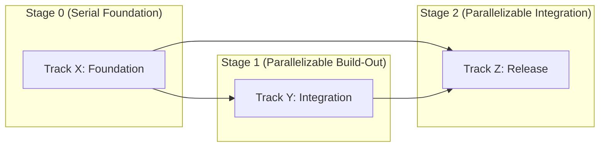

# Lyzor Tx In-Silico Pipeline Plan

## Parallel Execution View

- Tracks in the same stage box can run in parallel unless blocked by their own incoming dependencies.

## Track X: Foundation

- **Guiding Principle:** Build the base layer.
- [x] **TX01** Set up schema. Implemented in `src/schema.py`. Regression baseline: `baselines/tx01.json`. Model:
      `gpt-5.4-mini`.
  - Schema file exists
  - Passes validation
- [ ] **TX02** Add migration support. Model: `gpt-5.4`.
  - Migrations run without error

## Track Y: Integration

- **Guiding Principle:** Wire components together.
- [x] **TY01** Connect API to schema
  - API returns valid responses
  - Error codes documented

## Track Z: Release

- [ ] **TZ01** Cut release candidate. Model: `gpt-5.4`.
  - All tests pass on clean checkout
  - Version tag applied
